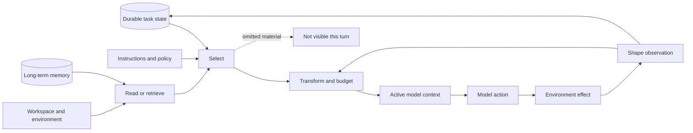
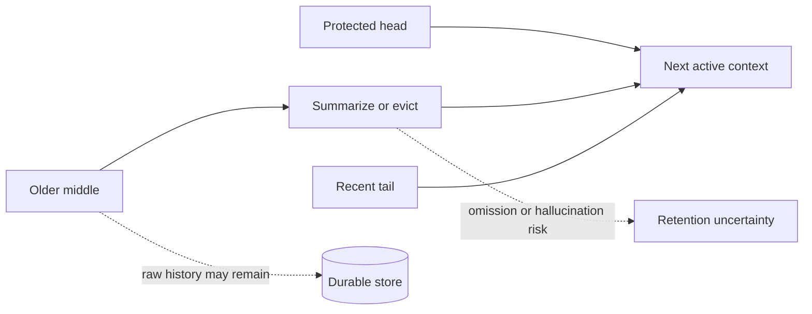

# Context Management in Agent Harnesses

## What the model sees is a product decision

An agent has spent forty minutes modifying a repository. It has read the requirements, inspected twenty files, run a build, encountered three errors, fixed two of them, delegated a search task, and accumulated a conversation longer than the model can accept.

The next model call does **not** see “everything the agent knows.” It sees a constructed artifact.

That artifact may contain a summary instead of the original requirements. The build output may contain its first 2,000 lines, its last 2,000 lines, a head-and-tail sample, or only a path to a spill file. The child agent may receive the full parent transcript, a focused task brief, or nothing but a working directory. A durable memory may exist but remain absent from this call because retrieval did not trigger. An earlier branch may still be stored while being completely invisible to the active model.

Those are not peripheral implementation details. They determine the evidence from which the model reasons.

This chapter compares four pinned, reviewed harnesses—Pi, OpenHands Software Agent SDK, OpenClaw, and Hermes Agent—along the same context-management decisions. The goal is not to crown a winner. It is to understand what each design preserves, what it spends, what it discards, and which failures its authors appear most concerned about.

**How to read this chapter.** The six decision sections are self-contained, so you can enter at any one of them. If you are short on time, read the fast comparison table, the worked example, and the failure catalog, then return for the decisions that matter to your design. Codex and Letta are introduced early because every decision section uses them as contrasts. Exact evidence and pinned code locations sit behind collapsible blocks so the main line stays readable—expand them whenever a specific number matters to you.

**A note on vocabulary.** Industry writing increasingly calls this discipline **context engineering**: deciding what enters a model's limited attention, and in what form. This chapter says *context management* because it takes the harness-side view—the pipelines, budgets, projections, and failure policies that implement those decisions inside a production agent. When you read practitioner material on context engineering, the six decisions below are the machinery it describes; when a vendor says their harness "does context engineering," these six decisions are the questions that test what it actually does.

## The central idea: context is a projection, not a container

People often talk about “the context window” as if it were a bucket. The bucket metaphor hides most of the engineering.

A useful mental model is a **context pipeline**:

The model receives the output of selection and transformation. It does not directly consume the durable transcript, workspace, memory database, or raw environment.

Hold onto that framing, because every mechanism in this chapter is an answer to the same question: which transformations stood between what the system knew and what the model saw?

That distinction gives us six questions to ask of any harness:

| Context decision | What to inspect |
| --- | --- |
| **Initial construction** | Which instructions, tools, skills, files, and environment facts enter automatically? |
| **Acquisition** | How does the agent read, search, or retrieve material outside the active prompt? |
| **Observation shaping** | How are raw tool results bounded and represented to the model? |
| **History projection** | Which branch, events, or message types are eligible for the next call? |
| **Compaction** | What is summarized, evicted, retained, or archived under pressure? |
| **Context transfer** | What crosses into a child agent, resumed run, or future session? |

This six-part model is a teaching aid derived from the four implementations. It is not a replacement for the project's R1–R11 research lens. ([Context synthesis C001](../../research/claims/context-management-across-harnesses.md#c001))

> **Common confusion — persistence is not model awareness.**
>
> A fact can be safely stored on disk, visible to an operator, and absent from the next model call. “We did not lose the data” and “the agent can use the data now” are different claims.

## A fast comparison before the deep dive

All four harnesses accept the same constraint—a session accumulates more than any model call can carry—and disagree about the transaction: what to keep verbatim, what to transform, and when to take the loss.

| Axis | Pi | OpenHands SDK | OpenClaw | Hermes Agent |
| --- | --- | --- | --- | --- |
| **Primary retained trajectory** | Append-only JSONL session tree | Append-only event tree | JSONL transcript plus session, ingress, workspace, and memory stores | SQLite session and message records |
| **Active history** | Current branch; latest summary plus retained recent tail after compaction | Model-convertible active branch after condensation | Repaired context-engine projection with bounded provider messages | Active SQLite rows plus request-local additions |
| **File-read default** | First 2,000 lines and 50 KB; paginate with offset | Selected line range, then 16,000-character response cap | Tool-specific; bootstrap files have separate per-file and aggregate budgets | 500 lines by default, at most 2,000 lines and 100,000 returned characters |
| **Shell/terminal output** | Last 2,000 lines and 50 KB; full output spills to a temporary file | 30,000-character observation cap; full content may persist when configured | Live result cap scales 16K/32K/64K characters and stays under 30% of context | Per-result and per-turn budgets; large output spills and returns a preview plus path |
| **Compaction activation** | Enabled by default | None on bare `Agent`; default preset installs summarizer | Ordinary embedded runtime supports compaction and overflow recovery; context-engine plugins may differ | Fresh configuration enables in-place compression around 50% of effective context |
| **Child inheritance** | Optional extension sends an explicit task, not the parent transcript | Separate conversation, explicit task, shared workspace | Isolated by default; explicit same-agent transcript fork is available | Fresh session, explicit context, no parent context files or durable memory |

Read this table as a map of tradeoffs, not a scorecard. A larger cap may waste attention. A smaller cap may delete the only useful line. A durable raw transcript may improve recovery while doing nothing for the current call. A summary may save tokens while introducing a fluent error that is harder to notice than obvious truncation.

Evidence boundary for the comparison

- Pi: [reviewed source record and exact locations](../../research/sources/cp2-pi-v0.80.6.md#evidence-items-and-claim-references)
- OpenHands: [reviewed source record and exact locations](../../research/sources/cp2-openhands-sdk-v1.35.0.md#evidence-items-and-claim-references)
- OpenClaw: [reviewed source record and exact locations](../../research/sources/cp2-openclaw-v2026.6.6.md#evidence-items-and-claim-references)
- Hermes: [reviewed source record and exact locations](../../research/sources/cp2-hermes-agent-v0.18.2.md#evidence-items-and-claim-references)
- Status: verified implementation facts at the four pinned commits; the comparison and tradeoff language is inference
- Limit: configuration, extensions, alternate entry points, and later releases can change concrete behavior

## Two targeted contrasts: Codex and Letta

The four reviewed cases are the chapter's backbone. Two additional pinned inspections widen the design space without pretending to be full case studies.

### Codex CLI: “inherit all” is still a projection

At `rust-v0.144.6`, Codex has several distinct context products:

1. full initial context, including instructions, permissions, skills, plugins, extensions, world state, and bounded AGENTS files;
2. later-turn context that appends settings and world-state changes;
3. ordinary active history;
4. compacted continuation history;
5. a selectively inherited subagent projection;
6. experimental cross-run memory, disabled by default.

Automatic compaction defaults to 90 percent of the effective context window. Local fallback compaction asks a model to write a continuation handoff, preserves recent real user messages within a 20,000-token budget, and warns that repeated compaction can reduce accuracy. Remote compaction v2 uses a different replacement path and retains recent user, developer, and system material under a 64,000-token budget.

The subagent path is the sharper lesson. Multi-agent v2 defaults `fork_turns` to `all`, but “all” does not mean byte-for-byte transcript inheritance. The child gets system, developer, and user messages plus final assistant answers. Tool calls, tool results, reasoning, inter-agent chatter, and non-final assistant work are filtered out.

That is a deliberate answer to a hard question: **which parts of a trajectory are context, and which are implementation debris?** It reduces cost and noise, but a tool result or intermediate assistant statement that carried the key evidence can disappear.

### Letta: pay for guaranteed visibility or accept retrieval risk

Pinned Letta Code and open-server evidence makes information placement explicit:

| Letta context layer | Visibility and behavior |
| --- | --- |
| `system/` memory | Content becomes always-visible prompt material and continuously consumes context |
| Other memory files | Names and descriptions are visible; content requires an explicit read |
| Durable conversation history | Remains hybrid-searchable after leaving active context |
| Active transcript | Uses sliding-window compaction by default in the inspected open server |
| Reflection | Periodically reviews bounded transcript material and can update committed memory or skills |
| Ordinary child | Ephemeral and stateless: no MemFS (Letta's git-backed memory file store) and no memory blocks |
| Forked child | Explicitly inherits parent conversation history as reference |

This is not merely “persistent memory.” It is a placement economy. Important content placed in `system/` is reliably visible but permanently expensive. External content is cheaper but can be missed. Searchable history improves recovery but still depends on the agent forming the right query. Reflection can improve future context—or durably encode a mistaken interpretation.

The boundary matters: Letta Code `v0.28.11` and open server `0.16.8` are separately pinned sources. This chapter does not claim those commits are a compatibility-verified cloud release.

Evidence for the two targeted contrasts

- [Codex CLI context source record](../../research/sources/codex-cli-v0.144.6-context.md)
- [Letta Code and server context source record](../../research/sources/letta-code-v0.28.11-context.md)
- [Context synthesis C013](../../research/claims/context-management-across-harnesses.md#c013) and [C014](../../research/claims/context-management-across-harnesses.md#c014)
- Status: verified implementation facts for bounded pinned surfaces
- Limit: neither system received a full harness case study; live service internals and outcome effects remain outside the evidence boundary

### Reported comparator: Claude Code

One detailed Arize article reports that Claude Code combines a 256 KiB pre-read gate with a roughly 25,000-token post-read budget, deduplicates repeated reads of an unchanged range, spills oversized tool output while returning previews, compacts into a structured continuation summary, restores a small recent-file working set, and offers both blank and forked child-context paths.

That combination is architecturally interesting. It tries to remove duplicate evidence before compaction, preserve large raw output outside the prompt, then reconstruct a small working set after history replacement.

It is also **source-reported, not verified implementation fact**. The article names no stable Claude Code release boundary and says some limits are remotely tunable. Its descriptions of pinned open-source systems also contain version-sensitive mismatches: for example, it reports a lower OpenClaw bootstrap-file cap than the reviewed `v2026.6.6` code, and it describes Letta self-compaction where the pinned open server defaults to a separate sliding-window summarizer.

The right use is to retain Claude Code as a credible comparison lead without allowing its unpinned details to control the verified matrix.

Claude Code reporting boundary

- [Arize source record](../../research/sources/arize-2026-context-management-harnesses.md)
- [Context synthesis C015](../../research/claims/context-management-across-harnesses.md#c015)
- Status: source-reported claim
- Limit: no stable Claude Code version, direct code inspection, or mechanism-level outcome evaluation

## Decision 1: what enters before the agent asks for anything?

Initial construction creates the model's starting world. Here the harness turns configuration, repository conventions, tools, skills, and runtime state into the task as the model will perceive it—before the agent has asked a single question.

### Pi: progressive disclosure tied to active tools

Pi's coding prompt includes the working directory, date, active tool guidance, project instruction files, and skill metadata. It walks the repository ancestry for project context. Skills are advertised through metadata; their full bodies can be loaded on demand. When the active tool set changes, the prompt guidance and executable capability set are refreshed together.

This is a strong coherence property: a tool described to the model is meant to match a tool the runtime can actually execute. The cost is coupling. Extensions that change tools, prompts, or turn preparation sit directly in the context policy path.

The design bet is **progressive disclosure**: tell the model what resources exist, then spend context on full instructions only when needed.

### OpenHands: the prompt is part of the event model

OpenHands separates frozen agent policy from mutable conversation state. It materializes a system prompt and runtime tool schemas, stores them in a `SystemPromptEvent`, and combines the current active `View` with the current LLM and tool map for later calls. Static instructions can remain cacheable while dynamic repository, runtime, user, and conversation state changes.

The interesting choice is not merely prompt composition. The prompt and tools become inspectable events inside the same architecture that records actions and observations. That improves replay and analysis, but plugins, MCP servers, and triggered skills still make the effective call deployment-dependent.

### OpenClaw: cache stability versus per-run specificity

OpenClaw assembles policy-filtered tools, skills, memory guidance, workspace data, identity, sandbox information, and bootstrap files. It deliberately separates a cache-stable prefix from more dynamic channel, session, and provider material. Ordinary runs use full bootstrap injection by default; heartbeat and cron paths can receive lighter or empty bootstrap sets. Raw-model mode and plugin context engines can bypass or replace parts of the ordinary path.

The design bet is **reuse a stable policy prefix while varying the run-specific tail**. That can reduce provider prompt-cache cost. It also means you cannot describe “the OpenClaw prompt” without naming the route and context-engine mode.

### Hermes: session caching with explicit request-local additions

Hermes assembles identity, tools, skills, environment, project context, memory/profile information, provider information, and date into a system prompt that is cached for the session. Each call adds request-local history, recalled external memory, plugin context, tool schemas, and provider repairs without writing those additions back into durable history.

This favors session stability. It creates a freshness tradeoff: a successful mid-session memory or profile update may not appear in the cached prompt until invalidation, compression, or a later session rebuild.

### The tradeoff

All four systems want stable instructions and fresh state. They choose different cache and event boundaries.

- Rebuilding aggressively improves freshness but increases cost and prompt variability.
- Caching aggressively improves stability and provider reuse but can create stale snapshots.
- Advertising resources before loading them saves tokens but relies on the model to retrieve at the right moment.
- Automatically injecting everything avoids retrieval misses but consumes attention on irrelevant material.

The practical question is not “do you support project instructions?” It is: **which instructions are active on this exact call, how do they become stale, and what invalidates them?** The concrete byte budgets these assembly paths apply to instruction and bootstrap files—OpenClaw's per-file and aggregate caps, Codex's combined AGENTS budget, Hermes's model-window-scaled instruction budget—are quantified in Decision 2. ([Context synthesis C003](../../research/claims/context-management-across-harnesses.md#c003))

Exact implementation anchors for initial construction

- Pi: active-tool, instruction-file, skills-metadata, and extension-refresh assembly in [CP2-S001-E04](../../research/sources/cp2-pi-v0.80.6.md#evidence-items-and-claim-references)
- OpenHands: frozen agent policy materialized with runtime tools, plugins, skills, MCP, and the model view in [CP2-S002-E06](../../research/sources/cp2-openhands-sdk-v1.35.0.md#evidence-items-and-claim-references)
- OpenClaw: per-run materialization of provider, prompt, bootstrap, skills, context-engine state, and the effective tool set in [CP2-S005-E07](../../research/sources/cp2-openclaw-v2026.6.6.md#evidence-items-and-claim-references)
- Hermes: session-cached system prompt with request-local additions and restore-or-rebuild invalidation in [CP2-S009-E10](../../research/sources/cp2-hermes-agent-v0.18.2.md#evidence-items-and-claim-references)
- Status: verified implementation facts for the assembly and caching paths; the staleness and cache-boundary tradeoff framing is inference

## Decision 2: how does the agent acquire missing information?

A bigger model window does not remove the harness's own windows. Every implementation still bounds reads, tool output, bootstrap files, and total history, because attention, latency, and cost stay finite even when capacity grows.

Consider a 10,000-line source file whose declaration is near the top and whose failing branch is near the bottom.

### Pi favors the head for files and the tail for commands

Pi's read tool returns at most the first 2,000 lines and 50 KB by default, whichever limit is reached first. It exposes an offset for continuation. Its shell tool makes the opposite choice: it retains the last 2,000 lines and 50 KB, then writes the complete output to a temporary file.

This asymmetry is task-shaped:

- File declarations and module structure often begin near the head.
- Compiler summaries, assertion failures, and stack-trace conclusions often appear near the tail.

It is still a heuristic. A relevant function in the middle of a file or an early causal error in a long build log can disappear. The temporary file preserves recoverability for shell output, but the model must notice the pointer and choose to inspect it.

### OpenHands exposes explicit ranges, then caps observations

OpenHands's file editor returns a selected line range and caps the response at 16,000 characters. Terminal observations cap at 30,000 characters and can persist full content when an observation-persistence directory exists.

The model or caller participates in window selection. That makes pagination explicit and predictable. It also means a poor initial range is a retrieval error rather than a context-window error.

### OpenClaw budgets bootstrap separately from live tool results

OpenClaw treats workspace bootstrap and live results as distinct surfaces. At the reviewed pin, bootstrap defaults are 20,000 characters per file and 60,000 in aggregate; oversized bootstrap content uses a head-and-tail representation with a visible warning. Live tool results use context-sensitive ceilings: 16,000 characters for smaller windows, 32,000 at 100K tokens, and 64,000 at 200K tokens, while never claiming more than 30 percent of the model window.

This protects the rest of the prompt from a single result. It also means that buying a larger-context model does not automatically expose unlimited output: the harness preserves a ceiling because attention and cost remain finite.

### Hermes combines pagination with a larger hard ceiling

Hermes's `read_file` defaults to 500 lines, allows at most 2,000 lines, and returns no more than 100,000 characters. It trims to complete lines and supplies a next offset when the character cap is reached. Project instruction files use a separate model-window-scaled budget, with explicit configuration able to override it; oversized content retains a larger head, a smaller tail, and an omission marker.

The pattern is now visible: **context acquisition is typed by source**. File content, shell output, bootstrap instructions, and tool observations do not deserve one universal truncation rule.

Codex and Letta reinforce the point. Codex gives combined AGENTS files a default 32 KiB budget separate from skill metadata, and bounds ordinary shell output at 10,000 tokens and one MiB per process before producing a head-and-tail model view. Letta Code's shell tool requests a 10,000-token default budget, also caps inline output at 30,000 characters, and retains a much larger process-local body. Similar numbers do not imply equivalent semantics: the spill location, retention lifetime, warning, and follow-up tools determine whether the omitted evidence is realistically recoverable.

> **Common confusion — “the model has a 200K window” does not mean the harness will send 200K of this result.**
>
> Harnesses reserve capacity for instructions, history, tool schemas, future work, and output. They also impose local caps to keep one source from monopolizing attention.

## Decision 3: what happened versus what the model was told

Suppose a build produces 80,000 characters. Somewhere near character 53,000 is the only failing assertion. What reaches the next call?

### Pi: visible loss with a recovery handle

The shell result keeps the tail and names the temporary file containing complete output. This makes the loss apparent and recoverable. The agent pays another read or search action if it needs the omitted region.

Pi also handles a different truncation risk at the model boundary: if a provider stops while tool-call arguments may be incomplete, the loop fails all such calls instead of executing potentially truncated arguments. That is context integrity applied to actions rather than observations.

### OpenHands: typed observation as the boundary

OpenHands converts executor output into a typed observation, wraps it in an event, and later converts that event into a model tool message. Tool-specific logic can add fields, status, truncation, or spill behavior before model visibility.

This makes the raw-result/observation distinction explicit. It is good for instrumentation and provider normalization. It also concentrates power in the transformer: an incorrect or lossy conversion can give the durable event model a clean record of the wrong evidence.

### OpenClaw: canonical, provider-facing, and recovery representations

OpenClaw has at least three relevant representations:

1. the canonical transcript result;
2. a bounded clone sent to the provider;
3. a last-resort persisted rewrite used during overflow recovery.

For ordinary live truncation, OpenClaw normally keeps the beginning. If the tail contains error-like language, a traceback, a closing JSON structure, or summary-like terms, it keeps a bounded tail as well and inserts a middle-omission marker. The result remains capped.

The distinction matters because ordinary provider shaping can preserve fuller canonical history, while recovery-time rewriting can change the persisted transcript. A liveness mechanism has become a durability decision.

### Hermes: spill the body, return a preview

Hermes budgets both individual results and the aggregate tool output for a turn. Large content can spill to disk while the model receives a 1,500-character preview (the pinned default) plus the spill path. Post-execution logic can also add subdirectory hints, guardrail guidance, plugin transformations, or multimodal normalization.

This is a **retrieve-on-demand observation**. It protects the next call and retains complete content. Its failure mode is behavioral: the model may accept the preview as sufficient and never retrieve the body.

### Same environment result, four epistemic outcomes

| Policy | What the model gains | What it risks losing | Recovery cost |
| --- | --- | --- | --- |
| Head | setup, schema, early declarations | final error or outcome | paginate or search later |
| Tail | final error, summary, recent output | initial cause and context | inspect full spill or rerun narrowly |
| Head + tail | both boundaries | decisive middle | retrieve full result or target the middle |
| Preview + path | small clue plus complete recoverability | evidence the model does not choose to fetch | another tool call and correct follow-up judgment |
| Typed observation | normalized status and structure | detail dropped or misrepresented by conversion | inspect raw executor artifact if retained |

There is no context-free winner. A good policy is output-aware, makes omission obvious, preserves a retrieval route when possible, and tests whether the route is actually used. ([Context synthesis C004](../../research/claims/context-management-across-harnesses.md#c004))

Exact implementation anchors for result shaping

- Pi: exact head/tail limits, continuation, and spill behavior in [CP2-S001-E12](../../research/sources/cp2-pi-v0.80.6.md#evidence-items-and-claim-references)
- OpenHands: exact file/terminal caps and persistence condition in [CP2-S002-E15](../../research/sources/cp2-openhands-sdk-v1.35.0.md#evidence-items-and-claim-references), plus the typed action/observation boundary in [CP2-S002-E08](../../research/sources/cp2-openhands-sdk-v1.35.0.md#evidence-items-and-claim-references)
- OpenClaw: exact bootstrap and live-result budgets in [CP2-S005-E21](../../research/sources/cp2-openclaw-v2026.6.6.md#evidence-items-and-claim-references), plus canonical/provider/recovery projections in [CP2-S005-E10](../../research/sources/cp2-openclaw-v2026.6.6.md#evidence-items-and-claim-references)
- Hermes: exact read, instruction, per-result, aggregate, preview, and spill limits in [CP2-S009-E26](../../research/sources/cp2-hermes-agent-v0.18.2.md#evidence-items-and-claim-references), plus the execution and observation-insertion path in [CP2-S009-E12](../../research/sources/cp2-hermes-agent-v0.18.2.md#evidence-items-and-claim-references)
- Status: verified implementation facts; information-value tradeoffs are engineering inference

## Decision 4: which history is active?

The most important architectural distinction in this chapter is **durable history versus active projection**.

### Pi: one branch of an append-only tree

Pi sessions are append-only JSONL trees. Entries identify parents; moving the leaf can create a new branch without erasing the abandoned one. The model view follows the active leaf. After compaction, it includes the summary, selected retained entries, and later events.

This supports branching and auditability. It also means the next model call is reasoning over a path, not over everything the session stores.

### OpenHands: event log and `View`

OpenHands retains an event tree while deriving a `View` that is never itself persisted. The `View` follows the active branch, admits model-convertible events, applies condensation, excludes internal control events, and enforces action/observation pairing rules.

This is a particularly clean separation of concerns:

- the event log answers what happened;
- the branch head answers which history is current;
- the `View` answers what the model may see.

### OpenClaw: a federation, not one history

OpenClaw complicates the picture productively. Channel ingress, session metadata, transcript messages, workspace files, memory, and in-process attempt state have different durability and recovery rules. The context engine operates on a repaired projection, not on an undifferentiated “memory.”

This is why claims like “OpenClaw persists the conversation” are too vague. Which store? Which lifecycle? Does the model see it now? Can it survive a process crash? Can a provider accept the representation?

### Hermes: active and archived rows in one session

Hermes uses SQLite as the canonical session substrate. In-place compression can soft-archive older active rows and insert a compacted projection atomically under the same session ID. The original rows remain searchable and recoverable even though the ordinary model path uses the smaller active set.

The common architecture is not the file format. It is the projection boundary: **all four store more than the model receives**. ([Context synthesis C002](../../research/claims/context-management-across-harnesses.md#c002))

## Decision 5: what happens when history no longer fits?

Compaction is often described as “summarize the conversation.” That phrase hides the choices that determine risk:

- when the operation triggers;
- which messages are protected;
- where a legal cut may occur;
- whether tool-call/result pairs stay intact;
- whether a previous summary is folded into the next;
- what raw data remains recoverable;
- what happens when the summarizer fails;
- whether the successful model response is replayed;
- and whether compaction itself can loop or consume most of the latency budget.

> **Common confusion — a fluent summary reads as complete.**
>
> Truncation announces itself: the model can see that material was cut. A summary that silently dropped one requirement does not. That asymmetry is why a harness's failure posture and retention testing often matter more than its summarizer prompt.

### The common shape

### Pi: structured summary plus a recent tail

Pi enables compaction by default. At the reviewed pin it reserves 16,384 tokens and aims to keep 20,000 recent tokens. It walks backward to a legal boundary rather than cutting at an arbitrary tool result, asks a model for a structured summary of the older region, folds in a previous summary when needed, and appends lists of files read or modified. The old tree remains durable.

Threshold compaction prepares future calls; overflow recovery can compact and retry once. The retry cap avoids an infinite compact-fail loop.

**What Pi optimizes for:** a compact, coherent coding session that preserves recent work and explicit file-state cues.

**What remains unproven:** whether the structured summary retains the right requirements, failed hypotheses, and causal details across real long-horizon coding tasks.

### OpenHands: optional at the constructor, opinionated in the preset

A bare OpenHands `Agent(...)` has no condenser. The opinionated default preset installs an LLM summarizer. At the reviewed pin that preset uses an event-count policy of at most 80 events and keeps the first four; generic condenser defaults differ. It retains a head and suffix, summarizes the forgotten middle, and records a durable `Condensation` event containing the forgotten IDs and summary.

Soft pressure can fail without changing the current view. Hard token or explicit pressure retries with progressively smaller summary input and eventually propagates failure.

**What OpenHands optimizes for:** make condensation an inspectable, configurable event transformation instead of an invisible mutation.

**What remains unproven:** the semantic quality of the summary and whether the opinionated preset improves task completion rather than merely enabling longer runs.

### OpenClaw: compaction inside a liveness envelope

OpenClaw's ordinary embedded path can invoke runtime compaction after history repair and limiting. OpenClaw raises the compaction reserve floor, detects overflow and high-context timeouts, bounds retry attempts, resumes from the transcript without replaying the inbound request, and can attempt persisted tool-result truncation before giving up with reset guidance. Plugin context engines may own the process instead.

**What OpenClaw optimizes for:** keep a long-lived, multi-channel agent making forward progress through provider and context failures.

**What it pays:** more recovery states and more chances for durable, active, and provider-visible representations to diverge.

### Hermes: non-destructive storage with a lossy default fallback

Fresh Hermes configuration enables in-place compression near 50 percent of the effective context window, with route-specific overrides possible. On the first compression, the compressor protects the system prompt plus the first three non-system messages and a recent region, prunes older tool output and oversized call arguments, and asks an auxiliary model for a structured middle summary. The special early-message protection decays after the first compression so those turns do not remain permanently pinned. Old active rows are soft-archived; the new projection is inserted atomically.

The failure policy is revealing. Authentication and network failures preserve history. With the default `abort_on_summary_failure=false`, an ordinary summarizer failure can drop the middle and insert a deterministic bounded continuity placeholder. Operators can instead configure all summary failures to abort and preserve the current history. Repeated compaction emits a quality warning.

**What Hermes optimizes for:** continue operating even when the summarizer itself fails, while preserving raw rows for later recovery.

**What it risks:** forward progress with a model-visible gap whose durable source still exists but is no longer in the active trajectory.

Exact implementation anchors for compaction defaults and failure posture

- Pi: trigger, protected recent region, structured summary, repeated compaction, and defaults in [CP2-S001-E12](../../research/sources/cp2-pi-v0.80.6.md#evidence-items-and-claim-references)
- OpenHands: bare-agent versus preset defaults and the 80-event/four-event policy in [CP2-S002-E15](../../research/sources/cp2-openhands-sdk-v1.35.0.md#evidence-items-and-claim-references)
- OpenClaw: runtime compaction and bounded recovery in [CP2-S005-E08](../../research/sources/cp2-openclaw-v2026.6.6.md#evidence-items-and-claim-references) and provider-facing/persisted result projections in [CP2-S005-E10](../../research/sources/cp2-openclaw-v2026.6.6.md#evidence-items-and-claim-references)
- Hermes: threshold, protected regions, pruning, soft archival, and summary-failure split in [CP2-S009-E26](../../research/sources/cp2-hermes-agent-v0.18.2.md#evidence-items-and-claim-references)
- Status: verified implementation facts; the stated optimization priorities and semantic-retention risks are engineering inferences

### Four failure philosophies

| Harness | When summary work fails or pressure persists | Implied priority |
| --- | --- | --- |
| Pi | Bound compaction/retry and stop rather than repeat indefinitely | predictable loop termination |
| OpenHands | Soft pressure can retain current view; hard pressure retries and can propagate failure | distinguish optional optimization from mandatory capacity recovery |
| OpenClaw | Escalate through compaction and recovery, then return reset/new-session guidance | long-lived service liveness with bounded fallback |
| Hermes | Preserve on selected infrastructure failures; otherwise default can continue with a deterministic lossy placeholder | forward progress plus recoverable raw storage |

Codex and Letta add two more shapes. Codex has separate local and remote compaction paths and explicitly warns after local compaction that repeated compactions can reduce accuracy. Letta's inspected server uses a separate provider-appropriate summarizer and sliding-window policy by default, keeps a recent tail, and makes durable older conversation searchable rather than assuming the summary is the only recovery path.

This is the comparison that “supports summarization” misses. The important design choice is often not the summarizer prompt. It is **what the harness does when its compression transaction is uncertain**.

## What research says about compaction—and what it does not

Two recent preprints apply useful pressure to the common LLM-summary design.

Semenov and Dorofeev characterize summarization compaction as potentially lossy, blocking, destructive, and hallucination-prone, then propose typed episodes with deterministic, dependency-aware eviction. Their first release reports one very long run and explicitly leaves broader evaluation and ablation for future work.

Cim and collaborators evaluate synchronous compaction across four model backbones on HotpotQA and LoCoMo. They report that compaction consumed up to 62 percent of wall time in tested low-threshold settings and that ten-run summaries varied in volume and semantic content. Their tasks, models, thresholds, and serving architecture differ from these coding and production harnesses.

These papers do **not** prove that Pi, OpenHands, OpenClaw, or Hermes compaction harms task outcomes. They do establish credible failure and cost hypotheses that the repositories' mechanical tests do not answer.

The correct status is **contested implementation practice**:

- widely implemented in the reviewed cases;
- plausibly useful for capacity and continuity;
- exposed to demonstrated general risks;
- not directly evaluated for retention at these pins.

Research evidence and limits

- [Beyond Compaction source record](../../research/sources/semenov-2026-beyond-compaction.md)
- [Parallel Context Compaction source record](../../research/sources/cim-2026-parallel-compaction.md)
- [Context synthesis C005](../../research/claims/context-management-across-harnesses.md#c005) and [C009](../../research/claims/context-management-across-harnesses.md#c009)
- Status: source-reported claims contextualizing a contested practice
- Limit: neither study directly evaluates these four pinned implementations, their hosted frontier models, or their coding and long-lived-agent workloads

## Decision 6: what does a child agent inherit?

Subagents are usually introduced as a parallelism or delegation feature. From a context perspective, each child is a new projection boundary.

### Pi: explicit task, separate process

Pi's reviewed core does not include a default subagent scheduler. Its example extension launches a separate Pi process and sends an explicit task plus optional agent prompt. It does not pass the parent transcript. Child output returned to the parent is bounded, while fuller detail can be retained separately.

### OpenHands: separate conversation, shared world

OpenHands delegation starts a new `LocalConversation`, sends the explicit task, and can persist child state under the parent directory. The child uses its own agent definition and conversation state while sharing the parent workspace. The parent receives aggregated final text, not a typed proof of success or the full child trajectory.

### OpenClaw: isolation by default, explicit fork as a policy

OpenClaw's session spawn defaults to isolated context. A caller can explicitly request a transcript fork for a same-agent child; cross-agent spawning must remain isolated at the reviewed pin. Context inheritance is therefore a call-site choice rather than a silent global behavior.

### Hermes: focused prompt, no parent files or memory

Hermes creates children with fresh sessions and budgets. The child receives an explicit goal, context, and workspace, but skips parent context files and durable memory. Its capability is no broader than the parent's. A bounded final summary returns; oversized content can spill for retrieval.

### Isolation is both protection and loss

Isolation reduces accidental prompt contamination, lowers token cost, and makes a child's job easier to state. It also creates **brief-writing risk**: every omitted constraint becomes unavailable unless the child rediscovers it from the shared environment.

Transcript inheritance has the inverse profile. It reduces briefing loss but imports irrelevant history, stale assumptions, adversarial content, and token cost.

> **Common confusion — a fresh context is not an independent mind.**
>
> A child with a fresh context is not automatically epistemically independent. If the same parent model writes the brief, the same model executes it, and the parent accepts a text summary, correlated errors remain likely. ([Context synthesis C006](../../research/claims/context-management-across-harnesses.md#c006))

Codex and Letta show that this need not be one global switch. Codex accepts `none`, the last N turns, or a filtered full-history projection. Letta exposes both stateless children and an explicit conversation fork. The useful design primitive is therefore not “subagents have context.” It is an **inheritance policy** specifying which roles, message types, tool evidence, memory stores, and capabilities cross the boundary.

## Memory is not history, and history is not context

These terms are routinely collapsed:

- **History** is a record of prior interaction or events.
- **Active context** is the representation sent to the model now.
- **Long-term memory** is information intended to survive and influence later work, often through retrieval or injection.
- **Adaptation** changes future artifacts or policy based on prior activity.
- **Optimization** selects changes because measured outcomes improved.

OpenClaw's default memory plugin exposes retrieval tools and guidance. A pre-compaction flush can ask the model to write durable notes. Disabled-by-default dreaming can promote repeatedly recalled and diverse material into long-term memory. Hermes uses bounded memory and user-profile files, can add an external recall provider, and has background processes that update memory or skills from conversation experience.

Letta makes the visibility hierarchy first-class: `system/` memory is always in prompt; other memory must be read; old conversation can be searched; periodic reflection may rewrite future memory. Codex's cross-run memory extension is experimental and disabled by default, a useful reminder that implemented capability and ordinary product behavior are different claims.

These are real adaptation mechanisms. Their signals—recall, diversity, recency, conversation content, model interpretation—are not task-outcome objectives. A frequently recalled mistake can be promoted just as easily as a frequently recalled truth unless another mechanism detects the problem.

MemoryAgentBench helps by separating four competencies: accurate retrieval, test-time learning, long-range understanding, and conflict resolution or selective forgetting. Its authors report that no evaluated method masters all four. It does not test these harnesses. It shows why “has memory” is too coarse to be useful.

Ask instead:

1. Who writes the memory?
2. Which evidence supports the write?
3. How is conflicting information represented?
4. What causes retrieval?
5. What happens when retrieval misses?
6. Can a bad memory be corrected or forgotten?
7. Does later task performance improve?

([Context synthesis C007](../../research/claims/context-management-across-harnesses.md#c007), [C010](../../research/claims/context-management-across-harnesses.md#c010))

## Worked example: the failing build after a long session

Return to our agent. Its history is near the limit. It runs a build that produces 80,000 characters. The decisive error is in the middle. What could happen?

### Pi path

1. The shell tool retains the last 2,000 lines and 50 KB.
2. Complete output is written to a temporary file.
3. The next model call sees the tail and the recovery pointer.
4. If the session also crosses its threshold, Pi summarizes older history and keeps recent work.
5. The raw session tree remains, but the active call uses the summary plus tail.

**Success condition:** the decisive error is near the tail or the model follows the spill pointer.

**Failure condition:** the summary drops a requirement and the model never inspects the middle of the build log.

### OpenHands path

1. Terminal execution becomes a typed observation capped at 30,000 characters.
2. Full content may be persisted if observation storage is configured.
3. The observation event enters the durable tree.
4. The active `View` admits its model-convertible representation.
5. If using the default preset and pressure triggers, a condensation event replaces older active events with a summary.

**Success condition:** observation shaping exposes the failure or preserves an accessible artifact, and condensation retains the requirement needed to interpret it.

**Failure condition:** the event log correctly records a bounded observation that omitted the decisive line; later condensation faithfully summarizes that incomplete evidence.

### OpenClaw path

1. The live result is capped according to context size and the 30-percent share rule.
2. If the tail looks diagnostic, the provider view receives head plus tail with an omission marker.
3. The fuller canonical result can remain in the transcript during ordinary shaping.
4. If the run overflows, compaction and bounded recovery execute.
5. Last-resort persisted truncation may alter the transcript before retry.

**Success condition:** diagnostic detection preserves the useful tail or later retrieval/projection recovers the canonical content.

**Failure condition:** the only useful line sits in the middle, then liveness recovery converts a temporary provider-view loss into persisted loss.

### Hermes path

1. Per-result and aggregate budgets detect oversized output.
2. Complete content spills to disk.
3. The model receives a preview and path.
4. If the session reaches its compression threshold, old tool output is pruned before the middle is summarized.
5. On an ordinary summary failure, default behavior may continue with a bounded continuity placeholder.

**Success condition:** the preview motivates a targeted read, and compression preserves the task state needed to interpret the result.

**Failure condition:** the model treats the preview as sufficient while compression removes the earlier causal chain.

This walkthrough exposes the real unit of design: not the context window, but the **sequence of lossy and recoverable transformations**.

## The failure catalog

Context failures are dangerous because they often remove the evidence needed to notice them.

| Failure | Example | Detection strategy | Mitigation |
| --- | --- | --- | --- |
| **Silent omission** | middle of a tool result disappears without a clear marker | compare raw and model-visible artifacts | explicit truncation metadata and recoverable handle |
| **Retrieval miss** | a project rule exists but never enters the call | task-level trace showing missing retrieval | better triggers, explicit resource inventory, targeted evaluation |
| **Stale injection** | cached profile or memory lags a successful write | inspect effective prompt after mutation | invalidate selectively or state freshness in the prompt |
| **Projection drift** | canonical history and active branch imply different task state | replay active projection from durable events | explicit branch IDs, deterministic projection tests |
| **Summary omission** | an original constraint disappears | retention probes against source requirements | structured fields, protected anchors, abort or recover path |
| **Summary hallucination** | compacted state invents a completed action | compare summary facts with durable events | fact extraction, references, deterministic validation |
| **Tool-pair corruption** | action survives without its result or vice versa | protocol invariant checks | atomic pair handling and repair |
| **Memory pollution** | model-authored interpretation becomes durable fact | conflict and provenance review | source links, confidence, correction/forgetting policy |
| **Child starvation** | delegated worker lacks a hidden constraint | compare brief with parent requirements | explicit handoff contract or controlled context fork |
| **Attention crowding** | everything technically fits, but irrelevant material dominates | ablation or task performance by context composition | priority budgets and progressive disclosure |

The last failure is important. Capacity is not the same as usable attention. A one-million-token prompt can still be a poor context if the relevant evidence is hard to locate, contradicted by stale state, or surrounded by low-value output. ([Context synthesis C008](../../research/claims/context-management-across-harnesses.md#c008))

## Design your context contract

Before choosing a vector database or a summarizer, write a contract for each information surface.

### 1. Name the source of truth

Is the authoritative record an event log, transcript tree, database row, workspace file, external service, or raw tool artifact? If two stores disagree, which one wins?

### 2. Define admission

What enters every call? What enters only on a new session, route, or task? What requires explicit retrieval? What can an extension inject?

### 3. Define the transformation

For every file, history, tool, and memory source, state:

- selection rule;
- ordering rule;
- character or token budget;
- head, tail, range, relevance, or summary policy;
- omission marker;
- recoverability path.

### 4. Define failure posture

When compaction or retrieval fails, does the harness:

- keep the full current view;
- retry with a smaller input;
- continue with a lossy placeholder;
- remove old tool payloads;
- start a new session;
- or stop and ask for intervention?

This decision often matters more than the happy-path algorithm.

### 5. Define boundary crossing

What survives:

- another model call;
- a process crash;
- a resumed session;
- a branch switch;
- a compaction;
- a subagent spawn;
- a new day or deployment?

### 6. Test information retention, not just mechanics

A test that proves “compaction emitted a summary event” does not prove the agent retained the acceptance criteria. Add task-level probes:

- Can the agent recall the original constraints after repeated compaction?
- Can it identify which approaches already failed and why?
- Can it retrieve a decisive middle section of a large tool result?
- Does a child obey requirements that were not in its explicit brief?
- Can a false memory be corrected?
- Does the same task succeed more often, faster, or more cheaply under the new policy?

This is an engineering recommendation, not a claim that one contract fits every product. ([Context synthesis C011](../../research/claims/context-management-across-harnesses.md#c011))

## What is genuinely learned, and what is still open

### Strongly supported within the inspected pins

- Durable state and active model context are separate architectural objects.
- Tool output is transformed before it becomes model evidence.
- Harness-level caps remain important even with large model windows.
- Compaction policies differ in activation, protected regions, persistence, and failure behavior.
- Subagent isolation and inheritance are explicit context-policy choices.

### Provisional engineering inferences

- Context quality is better analyzed as a pipeline of transformations than as a token bucket.
- Recoverability should be evaluated separately from immediate model visibility.
- The failure posture of compaction can be more consequential than the summary prompt.
- Output-type-specific policies are more defensible than one global truncation rule.

### Contested

- LLM summarization is common in the observed systems, but its semantic retention, latency, and variance are not adequately measured at these pins.
- Larger automatic injection can reduce retrieval misses while creating attention crowding and staleness.

### Open

- Which policies perform best on matched long-horizon coding tasks?
- How do closed production harnesses manage compaction and retrieval?
- How does perception-heavy browser work change the raw-result/observation boundary?
- When does transcript inheritance outperform isolated subagent briefs?
- Can outcome-based memory curation outperform usage- and recency-based promotion without excessive cost?

The four full cases plus two bounded topic inspections are a serious comparison, not a census of the field. OpenClaw and Hermes have explicit migration or influence links, so their similarities cannot automatically be counted as independent convergence. Claude Code remains a reported closed-source lead without a stable implementation boundary. Browser Use and other systems remain important future contrasts rather than undocumented rows in this table. ([Context synthesis C012](../../research/claims/context-management-across-harnesses.md#c012))

## Glossary

**Active context**  
The instructions, messages, tool schemas, retrieved material, and observations actually sent to a model for one call.

**Compaction**  
A transformation that reduces active history, often through summarization, eviction, pruning, or replacement.

**Condensation**  
OpenHands terminology for an event-level transformation that replaces selected model-visible events with a durable summary event.

**Context engineering**  
Industry term for the discipline of deciding what enters a model's limited attention and in what form. Often used broadly for practitioner-side prompt, retrieval, and memory strategy; this chapter's six decisions are the harness-side machinery that implements it.

**Context projection**  
The derived view selected from a larger retained state for model consumption.

**Durable state**  
Information intended to survive beyond the immediate call or process, such as events, transcript nodes, database rows, or workspace memory.

**MemFS**  
Letta's git-backed memory file store: memory lives in files whose edits require a stated reason, validation, and a git commit. Distinct from memory blocks, which are prompt-injected.

**Observation**  
The representation of an action's consequence that is made visible to the model; it may differ from raw execution output.

**Progressive disclosure**  
Advertising that information or capability exists, then loading full detail only when needed.

**Retrieval**  
Selecting information from a source outside the active prompt and injecting or returning it for use.

**Spill**  
Persisting oversized content outside the prompt and returning a smaller preview or retrieval handle.

## Recap

Context management is the harness's information policy.

The model reasons over a projection assembled from instructions, active history, tools, observations, retrieved memory, and runtime state. Pi, OpenHands, OpenClaw, and Hermes all preserve more than they send, and all transform large or old material before the next call. Each of the six decisions names a tension a builder must resolve deliberately:

1. **Initial construction** — stable injection versus fresh materialization, and the staleness every cache boundary can create.
2. **Acquisition** — head, tail, or explicit-range windows, budgeted by source type rather than one global truncation rule.
3. **Observation shaping** — inline truncation versus spill-and-retrieve, and whether omission stays visible and recoverable.
4. **History projection** — event projection versus transcript replay, with durable history always larger than the active view.
5. **Compaction** — soft failure versus lossy continuation versus bounded stop when the compression transaction is uncertain.
6. **Transfer** — isolated child briefs versus inherited context, remembering that a fresh context is not an independent mind.

Running beneath all six: durable memory is not active retrieval, and adaptation signals are not measured outcome optimization.

If you remember one question, make it this:

> **What exact evidence will the model receive on the next call, and what happened to everything else?**

## Reflection questions

1. Which context transformation in your current harness is most likely to delete evidence silently?
2. Do your logs preserve raw output, model-visible output, or both?
3. What is the source of truth after a compaction?
4. Can a child agent retrieve information omitted from its brief?
5. Which memory writes are grounded in external evidence rather than model interpretation?
6. What task-level test would reveal that your context policy is harmful?

## Suggested next reading

- [Agent-grade context synthesis](../../research/syntheses/context-management-across-harnesses.md)
- [Pi case study](../../research/case-studies/pi-v0.80.6.md), especially state, branching, and compaction
- [OpenHands SDK case study](../../research/case-studies/openhands-sdk-v1.35.0.md), especially active `View` and condensation
- [OpenClaw case study](../../research/case-studies/openclaw-v2026.6.6.md), especially federated state, result projections, and memory
- [Hermes Agent case study](../../research/case-studies/hermes-agent-v0.18.2.md), especially compression, spill behavior, and child context
- [Codex CLI bounded context inspection](../../research/sources/codex-cli-v0.144.6-context.md)
- [Letta Code and server bounded context inspection](../../research/sources/letta-code-v0.28.11-context.md)
- [MemoryAgentBench source record](../../research/sources/hou-2026-memoryagentbench.md)

## What changed in this rewrite

The previous learning pilot organized four systems around a broad control-loop thesis. Maintainer review found it too abstract, shallow, and governance-heavy to teach harness engineering. This replacement narrows the question to context management, compares the same mechanisms across all four pins, exposes exact defaults and failure behavior, and moves evidence detail behind the main explanation. The previous pilot remains recoverable in Git history; it is no longer the active learning chapter.

A Fable adversarial review completed on 2026-07-19. It spot-verified the chapter's implementation numbers directly against all six pinned checkouts—every sampled value was exact—confirmed the generated site derives from this Markdown through the pinned manifest, and produced three low-severity fixes now applied and recorded in [Reader Feedback](../READER-FEEDBACK.md). Maintainer review remains the final gate. Record unclear, unsupported, missing, or impractical material in Reader Feedback.
