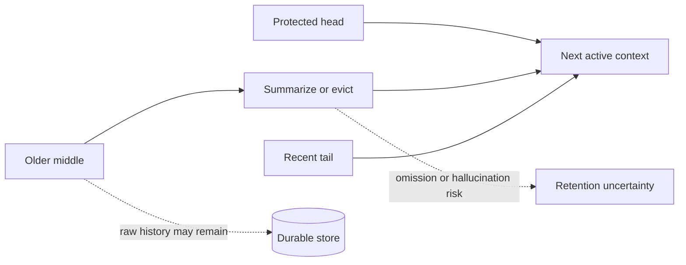
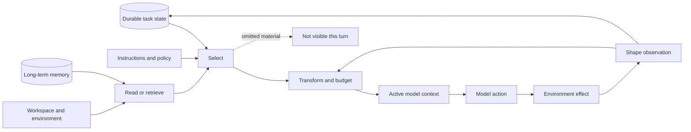

# Context Through the Life of a Task

## One session, told four ways

At 9:00 you hand an agent a task: a feature in a large repository is failing, and you want it fixed by the end of the day. The session that follows will read requirements, inspect twenty files, run builds, hit errors, delegate a search, outgrow the model's context window, and—if things go well—leave something useful behind for tomorrow.

This chapter runs that one session four times, once inside each of four pinned, reviewed harnesses—Pi, OpenHands Software Agent SDK, OpenClaw, and Hermes Agent—and watches a single thing: **what the model actually saw at each moment, and what happened to everything else.** Two additional pinned inspections, Codex CLI and Letta, appear at the moments where their designs sharpen a contrast, and one source-reported comparator, Claude Code, is kept clearly outside the verified evidence.

Industry writing increasingly calls this discipline **context engineering**: deciding what enters a model's limited attention, and in what form. This chapter watches the harness-side machinery that makes those decisions in production. By the end, the stages of the story will resolve into a reusable six-decision framework—but the story comes first, because every one of these mechanisms exists to answer a moment like the ones below.

> **Common confusion — persistence is not model awareness.**
>
> Throughout this story, information will be safely stored on disk yet absent from the model's next call. "We did not lose the data" and "the agent can use the data now" are different claims. Keep them separate and most of context management becomes legible.

## 9:00 — The session begins

Before the agent asks a single question, the harness has already built its world. Initial construction turns configuration, repository conventions, tools, skills, and runtime state into the task as the model will perceive it.

**Pi** assembles the working directory, date, active tool guidance, project instruction files, and skill metadata, walking the repository ancestry for project context. Skills are advertised through metadata and loaded in full only on demand—a bet on **progressive disclosure**: tell the model what exists, spend context only when needed. When the active tool set changes, prompt guidance and executable capability refresh together, which keeps the described tools honest but places extensions directly in the context policy path.

**OpenHands** separates frozen agent policy from mutable conversation state. It materializes a system prompt and runtime tool schemas, stores them as a `SystemPromptEvent`, and combines the active `View` with the current LLM and tool map for later calls. The prompt is not just assembled—it becomes an inspectable event inside the same architecture that records actions and observations.

**OpenClaw** assembles policy-filtered tools, skills, memory guidance, workspace data, identity, sandbox information, and bootstrap files, deliberately separating a cache-stable prefix from dynamic channel, session, and provider material. Ordinary runs get full bootstrap injection; heartbeat and cron paths can receive lighter or empty sets; raw-model mode and plugin context engines can bypass the ordinary path entirely. You cannot describe "the OpenClaw prompt" without naming the route.

**Hermes** builds identity, tools, skills, environment, project context, memory/profile information, provider information, and date into a system prompt cached for the session. Each call adds request-local history, recalled memory, plugin context, and provider repairs without writing them back into durable history. Session stability comes with a freshness bill: a mid-session profile update may not appear until invalidation or a later rebuild.

At 9:00, then, the same task already looks different in each harness—and each starting world can go stale in a different way. ([Context synthesis C003](../../research/claims/context-management-across-harnesses.md#c003))

Exact implementation anchors for initial construction

- Pi: active-tool, instruction-file, skills-metadata, and extension-refresh assembly in [CP2-S001-E04](../../research/sources/cp2-pi-v0.80.6.md#evidence-items-and-claim-references)
- OpenHands: frozen agent policy materialized with runtime tools, plugins, skills, MCP, and the model view in [CP2-S002-E06](../../research/sources/cp2-openhands-sdk-v1.35.0.md#evidence-items-and-claim-references)
- OpenClaw: per-run materialization of provider, prompt, bootstrap, skills, context-engine state, and the effective tool set in [CP2-S005-E07](../../research/sources/cp2-openclaw-v2026.6.6.md#evidence-items-and-claim-references)
- Hermes: session-cached system prompt with request-local additions and restore-or-rebuild invalidation in [CP2-S009-E10](../../research/sources/cp2-hermes-agent-v0.18.2.md#evidence-items-and-claim-references)
- Status: verified implementation facts for the assembly and caching paths; the staleness and cache-boundary tradeoff framing is inference

## 9:10 — Reading a 10,000-line file

The agent opens the failing module: 10,000 lines, declaration near the top, failing branch near the bottom. No harness hands the model the whole file by default, and each draws its window differently.

| Harness | File-read default | Continuation |
| --- | --- | --- |
| Pi | First 2,000 lines and 50 KB, whichever limit hits first | Explicit offset |
| OpenHands | Caller-selected line range, response capped at 16,000 characters | Choose a new range |
| OpenClaw | Tool-specific; bootstrap files carry separate per-file (20,000-character) and aggregate (60,000-character) budgets | Head-and-tail with a visible warning when oversized |
| Hermes | 500 lines by default, at most 2,000 lines and 100,000 characters, trimmed to complete lines | Supplied next offset |

Pi bets on the head, because declarations and module structure live there. OpenHands makes the reader choose a range, converting a bad guess into a retrieval error rather than a silent truncation. Hermes combines pagination with a larger hard ceiling. OpenClaw's sharpest move is typing the budget by *source*: bootstrap instructions and live results get different rules.

Codex and Letta echo the typing lesson: Codex gives combined AGENTS files a default 32 KiB budget separate from skill metadata and bounds ordinary shell output at 10,000 tokens and one MiB per process before producing a head-and-tail view; Letta Code's shell tool requests a 10,000-token default budget and caps inline output at 30,000 characters while retaining a larger process-local body. Similar numbers, different semantics—what matters is where the rest of the content went and whether the model can realistically get it back.

> **Common confusion — "the model has a 200K window" does not mean the harness will send 200K of this file.**
>
> Harnesses reserve capacity for instructions, history, tool schemas, and output, and impose local caps so no single source monopolizes attention.

## 9:40 — The build produces 80,000 characters

The agent runs the build. It fails, loudly: 80,000 characters of output, and the only decisive assertion sits near character 53,000—the middle. Here the four harnesses part ways most visibly, because what the model is told is not the same as what happened.

**In Pi's session**, the shell tool keeps the last 2,000 lines and 50 KB and writes the complete output to a temporary file. The loss is visible and recoverable—the model sees a tail and a pointer. Pi applies the same integrity instinct at the model boundary: if a provider stops while tool-call arguments may be incomplete, the loop fails those calls rather than executing potentially truncated arguments.

**In OpenHands' session**, terminal output becomes a typed observation capped at 30,000 characters; full content can persist when an observation directory is configured. The raw-result/observation distinction is explicit and durable—but the transformer holds real power, because a lossy conversion writes a clean record of the wrong evidence.

**In OpenClaw's session**, the live result is capped by context tier—16,000 characters on smaller windows, 32,000 at 100K tokens, 64,000 at 200K—and never more than 30 percent of the model window. OpenClaw normally keeps the beginning, but if the tail looks diagnostic (error language, a traceback, closing JSON, summary-like terms) it keeps a bounded tail too, with a middle-omission marker. Three representations coexist: the canonical transcript result, the bounded provider-facing clone, and a last-resort persisted rewrite used during overflow recovery.

**In Hermes' session**, per-result and per-turn budgets detect the oversized output, the full body spills to disk, and the model receives a 1,500-character preview (the pinned default) plus the spill path. The failure mode is behavioral: the model may accept the preview as sufficient and never retrieve the middle.

| Policy | The model gains | It risks losing | Recovery cost |
| --- | --- | --- | --- |
| Head | setup, schema, early declarations | final error or outcome | paginate or search later |
| Tail | final error, summary, recent output | initial cause | inspect full spill or rerun narrowly |
| Head + tail | both boundaries | the decisive middle | retrieve full result |
| Preview + path | a small clue plus full recoverability | evidence the model does not choose to fetch | another tool call, correctly judged |
| Typed observation | normalized status and structure | detail dropped by conversion | inspect raw artifact if retained |

At 9:40, our error at character 53,000 survives *durably* in every harness—and reaches the model's eyes in none of them by default. Whether the session recovers depends on whether omission was made obvious and whether the model uses the route back. ([Context synthesis C004](../../research/claims/context-management-across-harnesses.md#c004))

Exact implementation anchors for result shaping

- Pi: exact head/tail limits, continuation, and spill behavior in [CP2-S001-E12](../../research/sources/cp2-pi-v0.80.6.md#evidence-items-and-claim-references)
- OpenHands: exact file/terminal caps and persistence condition in [CP2-S002-E15](../../research/sources/cp2-openhands-sdk-v1.35.0.md#evidence-items-and-claim-references), plus the typed action/observation boundary in [CP2-S002-E08](../../research/sources/cp2-openhands-sdk-v1.35.0.md#evidence-items-and-claim-references)
- OpenClaw: exact bootstrap and live-result budgets in [CP2-S005-E21](../../research/sources/cp2-openclaw-v2026.6.6.md#evidence-items-and-claim-references), plus canonical/provider/recovery projections in [CP2-S005-E10](../../research/sources/cp2-openclaw-v2026.6.6.md#evidence-items-and-claim-references)
- Hermes: exact read, per-result, aggregate, preview, and spill limits in [CP2-S009-E26](../../research/sources/cp2-hermes-agent-v0.18.2.md#evidence-items-and-claim-references)
- Status: verified implementation facts; information-value tradeoffs are engineering inference

## 11:30 — The session outgrows the window

By late morning the transcript no longer fits. Two things are now true in every harness, and they are not the same thing: a **durable history** records what happened, and an **active projection** decides what the next call sees.

Pi sessions are append-only JSONL trees whose model view follows the active leaf. OpenHands retains an event tree and derives a never-persisted `View` that admits model-convertible events on the active branch. OpenClaw runs a federation—channel ingress, session metadata, transcript, workspace files, memory, and in-process attempt state with different durability rules—whose context engine operates on a repaired projection. Hermes keeps canonical session state in SQLite, where compression soft-archives older rows and inserts a compacted projection atomically under the same session ID. **All four store more than the model receives.** ([Context synthesis C002](../../research/claims/context-management-across-harnesses.md#c002))

When the projection itself must shrink, compaction begins, and its shape is common even where its policies differ:

> **Common confusion — a fluent summary reads as complete.**
>
> Truncation announces itself: the model can see that material was cut. A summary that silently dropped one requirement does not. That asymmetry is why a harness's failure posture often matters more than its summarizer prompt.

**Pi** compacts by default: 16,384 reserved tokens, a 20,000-token recent region, a walk back to a legal boundary, a structured model-written summary of the older region (folding in any previous summary), and appended lists of files read and modified. Overflow recovery can compact and retry once—a bound that prevents an infinite compact-fail loop.

**OpenHands** ships a bare `Agent` with no condenser at all; the opinionated preset installs an LLM summarizer with an event-count policy of at most 80 events keeping the first four (generic condenser defaults differ). Condensation is recorded as a durable event containing the forgotten IDs and the summary. Soft pressure may fail without changing the view; hard pressure retries with progressively smaller input and can propagate failure.

**OpenClaw** compacts inside a liveness envelope: it raises the compaction reserve floor, detects overflow and high-context timeouts, bounds retries, resumes from the transcript without replaying the inbound request, and can attempt persisted tool-result truncation before giving up with reset guidance. A liveness mechanism has become a durability decision.

**Hermes** compresses in place near 50 percent of the effective window: protects the system prompt, the first three non-system messages (a protection that decays after the first compression), and a recent region; prunes old tool output and oversized call arguments; asks an auxiliary model for a structured middle summary; and soft-archives the replaced rows. Its failure policy is the revealing part: with the default `abort_on_summary_failure=false`, an ordinary summarizer failure drops the middle and inserts a deterministic bounded continuity placeholder, while authentication and network failures preserve history. Repeated compaction emits a quality warning.

| Harness | When summary work fails or pressure persists | Implied priority |
| --- | --- | --- |
| Pi | Bound compaction/retry and stop | predictable loop termination |
| OpenHands | Soft pressure may retain the view; hard pressure retries, then propagates failure | separate optional optimization from mandatory recovery |
| OpenClaw | Escalate through compaction and recovery, then return reset guidance | long-lived service liveness |
| Hermes | Preserve on infrastructure failures; otherwise continue with a deterministic lossy placeholder | forward progress plus recoverable raw storage |

Codex adds two more shapes—automatic compaction at 90 percent of the effective window, a local fallback that writes a continuation handoff while preserving recent real user messages within 20,000 tokens (with an explicit warning that repeated compaction can reduce accuracy), and a remote v2 path with a 64,000-token retention budget. Letta's inspected server defaults to a sliding-window summarizer with a separate provider-appropriate model, and keeps older conversation durably searchable rather than treating the summary as the only route back.

Research applies useful pressure here. Semenov and Dorofeev characterize summarization compaction as potentially lossy, blocking, destructive, and hallucination-prone, proposing typed episodes with deterministic eviction—on the strength of one very long run. Cim and collaborators, across four model backbones on HotpotQA and LoCoMo, report compaction consuming up to 62 percent of wall time in low-threshold settings and ten-run summaries varying in volume and semantic content. Neither study evaluates these four pinned implementations or their workloads. The honest status of LLM-summary compaction is **contested implementation practice**: widely implemented, plausibly useful, exposed to demonstrated general risks, unmeasured at these pins. ([Context synthesis C005](../../research/claims/context-management-across-harnesses.md#c005), [C009](../../research/claims/context-management-across-harnesses.md#c009))

Exact implementation anchors for compaction defaults and failure posture

- Pi: trigger, protected recent region, structured summary, and defaults in [CP2-S001-E12](../../research/sources/cp2-pi-v0.80.6.md#evidence-items-and-claim-references)
- OpenHands: bare-agent versus preset defaults and the 80-event/four-event policy in [CP2-S002-E15](../../research/sources/cp2-openhands-sdk-v1.35.0.md#evidence-items-and-claim-references)
- OpenClaw: runtime compaction and bounded recovery in [CP2-S005-E08](../../research/sources/cp2-openclaw-v2026.6.6.md#evidence-items-and-claim-references)
- Hermes: threshold, protected regions, pruning, soft archival, and summary-failure split in [CP2-S009-E26](../../research/sources/cp2-hermes-agent-v0.18.2.md#evidence-items-and-claim-references)
- Status: verified implementation facts; the stated optimization priorities and semantic-retention risks are engineering inferences

## 2:00 — Delegating to a second agent

The agent decides a broad search is better done by a helper. From a context perspective, a child agent is a new projection boundary, and every harness answers the inheritance question differently.

- **Pi's** example extension launches a separate Pi process with an explicit task and optional agent prompt—no parent transcript. Child output returned to the parent is bounded.
- **OpenHands** starts a new `LocalConversation` with the explicit task, its own agent definition and state, and the shared parent workspace; the parent receives aggregated final text, not a typed proof of success.
- **OpenClaw** spawns isolated by default; a caller can explicitly request a transcript fork for a same-agent child, while cross-agent spawning must remain isolated at the reviewed pin. Inheritance is a call-site choice, not a global behavior.
- **Hermes** creates children with fresh sessions and budgets: explicit goal, context, and workspace, but no parent context files and no durable memory, with capability no broader than the parent. A bounded final summary returns; oversized content spills.

Codex shows this need not be one switch: `fork_turns` defaults to `all`, but "all" is itself a projection—the child receives system, developer, and user messages plus final assistant answers, while tool calls, tool results, reasoning, and non-final assistant work are filtered out as implementation debris. Letta exposes both stateless ephemeral children (no MemFS, no memory blocks) and an explicit conversation fork.

> **Common confusion — a fresh context is not an independent mind.**
>
> If the same parent model writes the brief, the same model executes it, and the parent accepts a text summary, correlated errors remain likely. ([Context synthesis C006](../../research/claims/context-management-across-harnesses.md#c006))

Isolation reduces contamination and cost but creates brief-writing risk: every omitted constraint is unavailable unless the child rediscovers it. Inheritance reduces briefing loss but imports irrelevant history, stale assumptions, and token cost. The useful design primitive is an **inheritance policy**—which roles, message types, tool evidence, memory stores, and capabilities cross the boundary.

## Tomorrow — The next session

The fix ships at 6:00. What survives the night?

Here the vocabulary must be kept straight: **history** records prior interaction; **active context** is what the model sees now; **long-term memory** is information intended to survive and influence later work; **adaptation** changes future artifacts based on prior activity; **optimization** selects changes because measured outcomes improved. These are five different claims, and the reviewed systems support them unevenly.

OpenClaw's default memory plugin exposes retrieval tools and guidance; a pre-compaction flush can ask the model to write durable notes; disabled-by-default dreaming can promote repeatedly recalled and diverse material into long-term memory. Hermes keeps bounded memory and user-profile files, can add an external recall provider, and runs background processes that update memory or skills from conversation experience. Letta makes placement the explicit economy: `system/` memory is always visible and permanently expensive; other memory shows names and descriptions but requires an explicit read; old conversation stays hybrid-searchable; periodic reflection may rewrite committed memory or skills. Codex's cross-run memory extension is experimental and disabled by default—a reminder that implemented capability and ordinary behavior are different claims.

None of these signals—recall frequency, diversity, recency, model interpretation—is a task-outcome objective. A frequently recalled mistake can be promoted as easily as a frequently recalled truth. MemoryAgentBench separates four competencies (accurate retrieval, test-time learning, long-range understanding, conflict resolution) and reports that no evaluated method masters all four; it does not test these harnesses, but it shows why "has memory" is too coarse to mean anything. ([Context synthesis C007](../../research/claims/context-management-across-harnesses.md#c007), [C010](../../research/claims/context-management-across-harnesses.md#c010))

## What the story was really about

Strip the timestamps away and the day resolves into a pipeline the model sat at the end of:

Every stage of the story was one of six recurring decisions, and together they are the questions to ask of any harness—this chapter's durable takeaway. ([Context synthesis C001](../../research/claims/context-management-across-harnesses.md#c001))

| Story moment | Context decision | The question |
| --- | --- | --- |
| 9:00, the session begins | **Initial construction** | Which instructions, tools, skills, and environment facts enter automatically, and how do they go stale? |
| 9:10, the huge file | **Acquisition** | How does the agent read or retrieve material outside the prompt, and with what windows? |
| 9:40, the failing build | **Observation shaping** | How are raw results bounded and represented, and is omission obvious and recoverable? |
| 11:30, the long transcript | **History projection & compaction** | Which history is active, what is summarized or evicted, and what happens when compression fails? |
| 2:00, the helper | **Context transfer** | What crosses into a child agent, and by what explicit policy? |
| Tomorrow | **Memory** | Who writes it, what evidence supports it, what triggers retrieval, and can it be corrected? |

## When the story goes wrong

Context failures are dangerous because they often remove the evidence needed to notice them.

| Failure | Example from the story | Detection strategy | Mitigation |
| --- | --- | --- | --- |
| **Silent omission** | the middle of the build log disappears without a marker | compare raw and model-visible artifacts | explicit truncation metadata and a recoverable handle |
| **Retrieval miss** | a project rule exists but never enters the call | task-level trace showing missing retrieval | better triggers, explicit resource inventory |
| **Stale injection** | the cached profile lags a successful mid-session write | inspect the effective prompt after mutation | invalidate selectively or state freshness |
| **Projection drift** | canonical history and active branch imply different states | replay the projection from durable events | explicit branch IDs, deterministic projection tests |
| **Summary omission** | the 9:05 requirement vanishes at 11:30 | retention probes against source requirements | structured fields, protected anchors, abort-or-recover path |
| **Summary hallucination** | the compacted state invents a completed action | compare summary facts with durable events | fact extraction, references, validation |
| **Tool-pair corruption** | an action survives without its result | protocol invariant checks | atomic pair handling and repair |
| **Memory pollution** | a model interpretation becomes durable fact | conflict and provenance review | source links, confidence, forgetting policy |
| **Child starvation** | the 2:00 helper lacks a hidden constraint | compare the brief with parent requirements | explicit handoff contract or controlled fork |
| **Attention crowding** | everything fits, yet irrelevant material dominates | task performance by context composition | priority budgets and progressive disclosure |

([Context synthesis C008](../../research/claims/context-management-across-harnesses.md#c008))

## Write the contract before the session starts

If you build or operate a harness, the day above is your requirements document. Before choosing a vector database or a summarizer, write a contract for each information surface:

1. **Name the source of truth.** If two stores disagree, which wins?
2. **Define admission.** What enters every call, what enters per session or route, what requires retrieval?
3. **Define the transformation.** For every source: selection rule, budget, window policy, omission marker, recoverability path.
4. **Define failure posture.** When compaction or retrieval fails—keep the view, retry smaller, continue lossily, or stop and ask?
5. **Define boundary crossing.** What survives another call, a crash, a resume, a compaction, a child spawn, a new day?
6. **Test retention, not just mechanics.** Can the agent recall the original constraints after repeated compaction? Retrieve the decisive middle of a large result? Does a child obey a rule that was not in its brief?

This is an engineering recommendation, not a claim that one contract fits every product. ([Context synthesis C011](../../research/claims/context-management-across-harnesses.md#c011))

## What is settled, and what is still open

**Strongly supported within the inspected pins:** durable state and active context are separate architectural objects; tool output is transformed before it becomes model evidence; harness-level caps survive large model windows; compaction policies differ in activation, protection, persistence, and failure behavior; subagent inheritance is an explicit policy choice.

**Provisional inferences:** context is better analyzed as a pipeline of transformations than a token bucket; recoverability deserves evaluation separate from immediate visibility; compaction failure posture can matter more than the summary prompt.

**Contested:** the semantic retention, latency, and variance of LLM-summary compaction at these pins.

**Open:** which policies win on matched long-horizon tasks; how closed production harnesses behave; when transcript inheritance beats isolated briefs; whether outcome-based memory curation can beat usage-based promotion.

The four full cases plus two bounded inspections are a serious comparison, not a census. OpenClaw and Hermes have explicit migration and influence links, so their similarities cannot be counted as independent convergence. Claude Code remains a source-reported lead without a stable boundary. ([Context synthesis C012](../../research/claims/context-management-across-harnesses.md#c012))

## Recap

One task, four harnesses, one lesson: the model never saw the session—it saw a sequence of constructed artifacts, each produced by selection, transformation, and budgeting, each discarding something the system still knew.

If you remember one question, make it this:

> **What exact evidence will the model receive on the next call, and what happened to everything else?**

## Reflection questions

1. At which timestamp in this story would your current harness have lost the decisive evidence?
2. Do your logs preserve raw output, model-visible output, or both?
3. What is the source of truth after a compaction?
4. Can a child agent retrieve information omitted from its brief?
5. What task-level test would reveal that your context policy is harmful?

## Suggested next reading

- [Agent-grade context synthesis](../../research/syntheses/context-management-across-harnesses.md)
- [Pi case study](../../research/case-studies/pi-v0.80.6.md) · [OpenHands SDK case study](../../research/case-studies/openhands-sdk-v1.35.0.md) · [OpenClaw case study](../../research/case-studies/openclaw-v2026.6.6.md) · [Hermes Agent case study](../../research/case-studies/hermes-agent-v0.18.2.md)
- [Codex CLI bounded context inspection](../../research/sources/codex-cli-v0.144.6-context.md) · [Letta bounded context inspection](../../research/sources/letta-code-v0.28.11-context.md)
