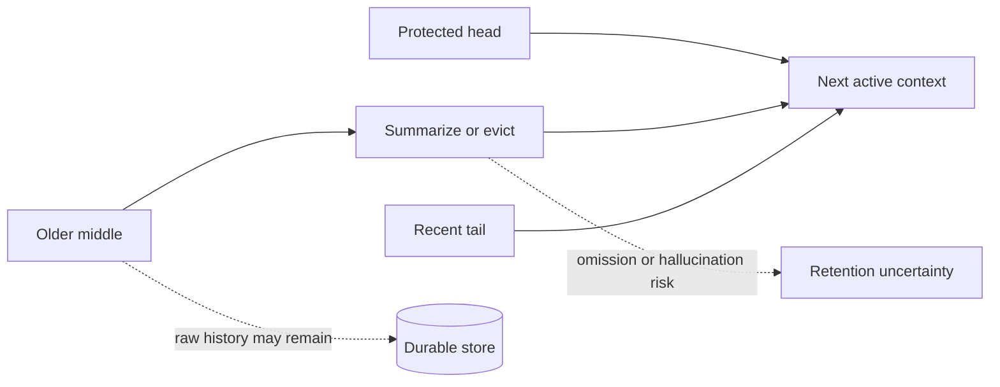
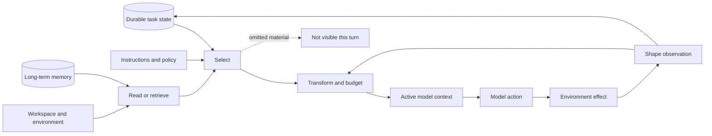

# Why Agents Forget

## Diagnosing context failure in production harnesses

Anyone who operates coding or long-lived agents has said at least one of these sentences:

1. *"The error was right there in the build output—why did it say the build passed?"*
2. *"It knew the requirement an hour ago. Where did it go?"*
3. *"The rule is in the repo. It read the directory. It still violated it."*
4. *"The subagent broke a constraint the main agent knew perfectly well."*
5. *"It keeps confidently repeating something that was never true."*

Each sentence is a **context failure**: the model reasoned correctly over the evidence it received, and the evidence was wrong—bounded, stale, projected, compacted, transferred, or polluted somewhere between the world and the prompt. Industry writing calls the discipline of controlling that evidence **context engineering**; this chapter approaches it the way an operator meets it, failure first, then works backward into the machinery.

The machinery comes from four pinned, reviewed harnesses—Pi, OpenHands Software Agent SDK, OpenClaw, and Hermes Agent—plus bounded pinned inspections of Codex CLI and Letta, and one clearly labeled source-reported comparator, Claude Code. What makes these failures dangerous is a shared property worth stating up front: **context failures usually remove the evidence needed to notice them.** The rest of this chapter is about designing so that they can't hide.

> **Common confusion — persistence is not model awareness.**
>
> In every failure below, the missing information still existed somewhere—on disk, in an event log, in a memory store. "We did not lose the data" and "the agent can use the data now" are different claims, and confusing them is how these failures stay invisible.

## Failure 1: "The answer was in the output"

**Symptom.** A build produces 80,000 characters. The only decisive assertion sits near character 53,000. The agent reads the result, declares a different cause, and starts editing the wrong file.

**Diagnosis.** No harness sends the model raw reality. Between execution and the next call sits a shaping step that bounds and represents the result—and the middle of a long output is the least protected region in every pinned design.

- **Pi** keeps the last 2,000 lines and 50 KB of shell output and writes the complete output to a temporary file: the loss is visible, and a recovery pointer exists—if the model uses it. For file reads, Pi keeps the head instead (first 2,000 lines and 50 KB, with an offset for continuation): declarations live at the top, errors at the bottom.
- **OpenHands** converts executor output into a typed observation capped at 30,000 characters (16,000 for file-editor responses), optionally persisting full content. The transformation is explicit and durable—which also means a lossy conversion writes a clean record of the wrong evidence.
- **OpenClaw** caps live results by context tier—16,000 characters on smaller windows, 32,000 at 100K tokens, 64,000 at 200K—never exceeding 30 percent of the model window. It keeps the beginning by default, but detects diagnostic-looking tails (error language, tracebacks, closing JSON) and preserves head plus tail with a middle-omission marker.
- **Hermes** budgets per result and per turn, spills large bodies to disk, and returns a 1,500-character preview (the pinned default) plus the path. Complete content survives; the risk moves into behavior—the model may accept the preview as sufficient.

**What contains it.** Obvious omission markers, a recoverable handle, and—the part mechanical tests miss—evidence that the model actually follows the handle. There is no context-free winner among head, tail, head-plus-tail, preview-plus-path, and typed observation; each pairs a different gain with a different silent loss. ([Context synthesis C004](../../research/claims/context-management-across-harnesses.md#c004))

Exact implementation anchors for result shaping

- Pi: exact head/tail limits, continuation, and spill behavior in [CP2-S001-E12](../../research/sources/cp2-pi-v0.80.6.md#evidence-items-and-claim-references)
- OpenHands: exact file/terminal caps and persistence condition in [CP2-S002-E15](../../research/sources/cp2-openhands-sdk-v1.35.0.md#evidence-items-and-claim-references), plus the typed action/observation boundary in [CP2-S002-E08](../../research/sources/cp2-openhands-sdk-v1.35.0.md#evidence-items-and-claim-references)
- OpenClaw: exact bootstrap and live-result budgets in [CP2-S005-E21](../../research/sources/cp2-openclaw-v2026.6.6.md#evidence-items-and-claim-references), plus canonical/provider/recovery projections in [CP2-S005-E10](../../research/sources/cp2-openclaw-v2026.6.6.md#evidence-items-and-claim-references)
- Hermes: exact read, per-result, aggregate, preview, and spill limits in [CP2-S009-E26](../../research/sources/cp2-hermes-agent-v0.18.2.md#evidence-items-and-claim-references)
- Status: verified implementation facts; information-value tradeoffs are engineering inference

## Failure 2: "It knew that an hour ago"

**Symptom.** Early in a long session the agent read the acceptance criteria. Hours and one compaction later, it ships something that violates them—while the transcript shows it once knew better.

**Diagnosis.** When history outgrows the window, every pinned harness compacts: a protected head and recent tail survive, and an older middle is summarized or evicted.

> **Common confusion — a fluent summary reads as complete.**
>
> Truncation announces itself; a summary that silently dropped one requirement does not. That asymmetry is why failure posture and retention testing often matter more than the summarizer prompt.

The four postures differ more than the four algorithms:

| Harness | Mechanics at the pin | When summary work fails |
| --- | --- | --- |
| **Pi** | Default-on; 16,384 reserved tokens, 20,000-token recent region, legal-boundary walk, structured summary folding in the previous one, appended lists of files read/modified | Compact-and-retry once, then stop—predictable termination |
| **OpenHands** | Bare `Agent` has no condenser; the default preset installs an LLM summarizer at 80 events keeping the first four (generic defaults differ); condensation is a durable event with the forgotten IDs | Soft pressure may leave the view unchanged; hard pressure retries smaller, then propagates failure |
| **OpenClaw** | Compaction inside a liveness envelope: raised reserve floor, overflow/timeout detection, bounded retries, resume-from-transcript, last-resort persisted result truncation | Escalate through recovery, then return reset guidance |
| **Hermes** | In-place compression near 50 percent of the window; protects system prompt, first three non-system messages (protection decays after first pass), and a recent region; prunes old tool output; soft-archives replaced rows | Default `abort_on_summary_failure=false`: continue with a deterministic lossy placeholder; auth/network failures preserve history; repeated compaction warns |

Codex compacts automatically at 90 percent of its effective window, warns that repeated compaction can reduce accuracy, and retains recent real user messages within a 20,000-token budget locally (64,000 in its remote v2 path). Letta's inspected server defaults to a sliding-window summarizer and keeps older conversation durably searchable—the summary is not the only way back.

**What research adds—and does not.** Semenov and Dorofeev characterize summary compaction as potentially lossy, blocking, destructive, and hallucination-prone (evidence: one very long run). Cim and collaborators measured compaction consuming up to 62 percent of wall time in low-threshold settings, with ten-run summaries varying semantically—on different tasks, models, and serving architectures. Neither tests these pins. The honest status is **contested implementation practice**: widely implemented, plausibly useful, exposed to demonstrated general risks, unmeasured here. ([Context synthesis C005](../../research/claims/context-management-across-harnesses.md#c005), [C009](../../research/claims/context-management-across-harnesses.md#c009))

**What contains it.** Structured summaries with protected anchors; durable raw history (all four keep it—Pi's session tree, OpenHands' event log, OpenClaw's transcript, Hermes' soft-archived rows); a deliberate failure posture; and retention probes that test whether the agent still knows the acceptance criteria, not merely whether a summary event was emitted.

Exact implementation anchors for compaction defaults and failure posture

- Pi: trigger, protected recent region, structured summary, and defaults in [CP2-S001-E12](../../research/sources/cp2-pi-v0.80.6.md#evidence-items-and-claim-references)
- OpenHands: bare-agent versus preset defaults and the 80-event/four-event policy in [CP2-S002-E15](../../research/sources/cp2-openhands-sdk-v1.35.0.md#evidence-items-and-claim-references)
- OpenClaw: runtime compaction and bounded recovery in [CP2-S005-E08](../../research/sources/cp2-openclaw-v2026.6.6.md#evidence-items-and-claim-references)
- Hermes: threshold, protected regions, pruning, soft archival, and summary-failure split in [CP2-S009-E26](../../research/sources/cp2-hermes-agent-v0.18.2.md#evidence-items-and-claim-references)
- Status: verified implementation facts; the stated priorities and semantic-retention risks are engineering inferences

## Failure 3: "The rule was in the repo the whole time"

**Symptom.** A project convention sits in an instruction file. The agent read neighboring files all morning and never consulted it—or consulted a version that a mid-session update had already made stale.

**Diagnosis.** This failure lives in **initial construction**: what enters the prompt before the agent asks for anything, and how it goes stale afterward.

- **Pi** walks the repository ancestry for project instruction files and advertises skills through metadata, loading full bodies on demand—**progressive disclosure**. The bet saves tokens; the cost is that retrieval must trigger at the right moment.
- **OpenHands** freezes agent policy and materializes it with runtime tool schemas into an inspectable `SystemPromptEvent`; dynamic state arrives through the active `View`.
- **OpenClaw** injects bootstrap files by default under separate budgets—20,000 characters per file, 60,000 aggregate, head-and-tail with a visible warning when oversized—while keeping a cache-stable prefix apart from run-specific material. Heartbeat and cron routes can receive lighter or empty bootstrap sets: the same agent, differently informed, by route.
- **Hermes** caches the assembled system prompt for the session and adds request-local material per call; project instruction files carry a model-window-scaled budget. A successful mid-session profile update may not appear until invalidation or rebuild—staleness by design, in exchange for cache stability.

Codex bounds combined AGENTS files at a default 32 KiB. The general tension: automatic injection avoids retrieval misses but crowds attention and can go stale; advertising resources saves tokens but relies on the model retrieving at the right moment. ([Context synthesis C003](../../research/claims/context-management-across-harnesses.md#c003))

**What contains it.** An explicit inventory of what is active on *this exact call*; freshness rules stated in the prompt or enforced by invalidation; and task-level traces that reveal retrieval misses, which look like model stupidity and are usually policy.

Exact implementation anchors for initial construction

- Pi: active-tool, instruction-file, skills-metadata, and extension-refresh assembly in [CP2-S001-E04](../../research/sources/cp2-pi-v0.80.6.md#evidence-items-and-claim-references)
- OpenHands: frozen agent policy materialized with runtime tools, plugins, skills, MCP, and the model view in [CP2-S002-E06](../../research/sources/cp2-openhands-sdk-v1.35.0.md#evidence-items-and-claim-references)
- OpenClaw: per-run materialization of provider, prompt, bootstrap, skills, context-engine state, and the effective tool set in [CP2-S005-E07](../../research/sources/cp2-openclaw-v2026.6.6.md#evidence-items-and-claim-references)
- Hermes: session-cached system prompt with request-local additions and restore-or-rebuild invalidation in [CP2-S009-E10](../../research/sources/cp2-hermes-agent-v0.18.2.md#evidence-items-and-claim-references)
- Status: verified implementation facts for the assembly and caching paths; the staleness tradeoff framing is inference

## Failure 4: "The subagent broke a rule it never saw"

**Symptom.** The main agent delegates a subtask. The child does competent work that violates a constraint the parent knew—because the constraint never crossed the boundary.

**Diagnosis.** A child agent is a new projection boundary, and at the reviewed pins isolation is the dominant default:

- **Pi's** example extension launches a separate process with an explicit task—no parent transcript; bounded child output returns.
- **OpenHands** starts a new `LocalConversation` with the explicit task and shared workspace; the parent receives aggregated final text.
- **OpenClaw** spawns isolated by default; same-agent transcript forking is an explicit call-site request; cross-agent spawning must remain isolated.
- **Hermes** gives children fresh sessions with explicit goal, context, and workspace—no parent context files, no durable memory, capability no broader than the parent.

Codex's multi-agent v2 defaults `fork_turns` to `all`—and "all" is still a projection: system, developer, and user messages plus final assistant answers cross; tool calls, tool results, reasoning, and non-final assistant work are filtered as implementation debris. A tool result that carried the key evidence disappears with the debris. Letta offers both stateless ephemeral children (no MemFS, no memory blocks) and an explicit conversation fork.

> **Common confusion — a fresh context is not an independent mind.**
>
> If the same parent model writes the brief, the same model executes it, and the parent accepts a text summary, correlated errors remain likely. ([Context synthesis C006](../../research/claims/context-management-across-harnesses.md#c006))

**What contains it.** Treating inheritance as a written policy—which roles, message types, tool evidence, memory stores, and capabilities cross—plus a handoff contract for briefs, and comparing the brief against parent requirements as a test, not a hope.

## Failure 5: "It remembered the wrong thing"

**Symptom.** Weeks in, the agent states a "fact" about your codebase that was never true. It appears in every session now. Deleting it feels impossible because nobody knows where it lives.

**Diagnosis.** Five words are routinely collapsed, and this failure grows in the gap between them: **history** (what happened), **active context** (what the model sees now), **memory** (what is meant to survive), **adaptation** (future artifacts change from experience), and **optimization** (changes selected because measured outcomes improved).

The reviewed mechanisms adapt; none of them optimizes. OpenClaw's memory plugin exposes retrieval tools, a pre-compaction flush can write durable notes, and disabled-by-default dreaming promotes repeatedly recalled, diverse material. Hermes updates memory and skills from conversation experience through background processes. Letta makes placement explicit—`system/` memory is always visible and permanently expensive; other memory requires an explicit read; old conversation stays searchable; reflection periodically rewrites committed memory, and MemFS edits require a reason, validation, and a git commit. Codex's cross-run memory is experimental and disabled by default.

The signals doing the promoting—recall frequency, diversity, recency, model interpretation—are not task outcomes. **A frequently recalled mistake is promoted as readily as a frequently recalled truth.** MemoryAgentBench separates accurate retrieval, test-time learning, long-range understanding, and conflict resolution, and reports no evaluated method mastering all four; it does not test these harnesses, but it explains why "has memory" predicts nothing. ([Context synthesis C007](../../research/claims/context-management-across-harnesses.md#c007), [C010](../../research/claims/context-management-across-harnesses.md#c010))

**What contains it.** Provenance on memory writes; conflict representation instead of silent overwrite; a correction and forgetting path (Letta's git-committed MemFS edits are one legible design); and skepticism toward any "self-improving" label until outcome evidence exists.

## The mechanism under every failure

All five failures are one mechanism seen from five angles. The model never consumes the durable transcript, workspace, memory store, or raw environment—it consumes the output of a pipeline:

Every failure above is a defect or an accepted loss in one pipeline stage. That yields a diagnostic checklist—six questions that locate any context failure ([Context synthesis C001](../../research/claims/context-management-across-harnesses.md#c001), [C002](../../research/claims/context-management-across-harnesses.md#c002)):

| When you see… | Interrogate this decision | Ask |
| --- | --- | --- |
| Rules ignored, stale profile behavior | **Initial construction** | What entered automatically, and how does it go stale? |
| Missing file or log evidence | **Acquisition** | What window bounded the read, and what continuation exists? |
| Confident claims contradicting raw output | **Observation shaping** | What did shaping drop, and was omission marked? |
| Behavior inconsistent with the stored transcript | **History projection** | Which branch and event types are active? |
| Knowledge loss after long sessions | **Compaction** | What was protected, what summarized, what happens on failure? |
| Children violating known constraints | **Context transfer** | What crossed the boundary, under which policy? |

## The full catalog

The five stories above are the most common entries in a longer catalog worth keeping at hand:

| Failure | Example | Detection strategy | Mitigation |
| --- | --- | --- | --- |
| **Silent omission** | middle of a tool result disappears without a marker | compare raw and model-visible artifacts | explicit truncation metadata, recoverable handle |
| **Retrieval miss** | a project rule never enters the call | task-level trace of missing retrieval | better triggers, resource inventory |
| **Stale injection** | cached memory lags a successful write | inspect the effective prompt after mutation | selective invalidation, stated freshness |
| **Projection drift** | canonical history and active branch disagree | replay projection from durable events | branch IDs, deterministic projection tests |
| **Summary omission** | an original constraint disappears | retention probes against requirements | structured fields, protected anchors |
| **Summary hallucination** | compacted state invents a completed action | compare summary facts with durable events | fact extraction, references, validation |
| **Tool-pair corruption** | an action survives without its result | protocol invariant checks | atomic pair handling and repair |
| **Memory pollution** | model interpretation becomes durable fact | conflict and provenance review | source links, confidence, forgetting policy |
| **Child starvation** | a delegated worker lacks a hidden constraint | compare brief with parent requirements | explicit handoff contract, controlled fork |
| **Attention crowding** | everything fits; the relevant is buried | task performance by context composition | priority budgets, progressive disclosure |

Capacity is not usable attention: a one-million-token prompt can still be a poor context if the relevant evidence is hard to locate or surrounded by low-value output. ([Context synthesis C008](../../research/claims/context-management-across-harnesses.md#c008))

## Building so failures cannot hide

The constructive conclusion of five diagnoses is a **context contract**, written per information surface before choosing any component:

1. **Name the source of truth** — if two stores disagree, which wins?
2. **Define admission** — every call, per session or route, or explicit retrieval only?
3. **Define the transformation** — selection rule, budget, window policy, omission marker, recoverability path, for each source type.
4. **Define failure posture** — keep the full view, retry smaller, continue lossily, or stop and ask?
5. **Define boundary crossing** — what survives a crash, a resume, a compaction, a child spawn, a new day?
6. **Test retention, not mechanics** — probe whether the agent still knows the constraints, finds the decisive middle, and whether children obey unbriefed rules; a test that proves "a summary event was emitted" proves nothing about knowledge.

This is an engineering recommendation, not a claim that one contract fits every product. ([Context synthesis C011](../../research/claims/context-management-across-harnesses.md#c011))

## Status of the evidence

**Strongly supported at the pins:** durable state and active context are separate objects; tool output is transformed before becoming evidence; harness caps survive large windows; compaction differs most in failure posture; inheritance is explicit policy.

**Contested:** semantic retention, latency, and variance of LLM-summary compaction.

**Open:** which policies win on matched long-horizon tasks; closed-harness behavior (the Claude Code reporting describes a 256 KiB pre-read gate, an approximately 25,000-token post-read budget, read deduplication, spill-with-preview, structured continuation summaries, and both blank and forked child paths—architecturally interesting, source-reported, version-unstable, and occasionally contradicted by pinned code it describes); when inheritance beats isolation; whether outcome-based memory curation is affordable.

Four cases and two bounded inspections are a serious comparison, not a census. OpenClaw and Hermes share migration and influence links, so recurrence between them is not independent convergence. ([Context synthesis C012](../../research/claims/context-management-across-harnesses.md#c012))

## Recap

Agents forget because harnesses choose—reasonably, deliberately, and sometimes wrongly—what the model gets to see. The five symptoms that open this chapter are not model failures; they are policy outcomes, each traceable to a pipeline stage, each testable, each containable.

If you remember one question, make it this:

> **What exact evidence will the model receive on the next call, and what happened to everything else?**

## Reflection questions

1. Which of the five symptoms has your agent shown most recently, and which pipeline stage produced it?
2. Do your logs let you compare raw output against model-visible output?
3. After a compaction, could you prove which requirements the agent still knows?
4. Could a bad memory in your system be found, corrected, and forgotten?
5. What would you instrument first, given one week?

## Suggested next reading

- [Agent-grade context synthesis](../../research/syntheses/context-management-across-harnesses.md)
- [Pi case study](../../research/case-studies/pi-v0.80.6.md) · [OpenHands SDK case study](../../research/case-studies/openhands-sdk-v1.35.0.md) · [OpenClaw case study](../../research/case-studies/openclaw-v2026.6.6.md) · [Hermes Agent case study](../../research/case-studies/hermes-agent-v0.18.2.md)
- [Codex CLI bounded context inspection](../../research/sources/codex-cli-v0.144.6-context.md) · [Letta bounded context inspection](../../research/sources/letta-code-v0.28.11-context.md)
- [MemoryAgentBench source record](../../research/sources/hou-2026-memoryagentbench.md)
