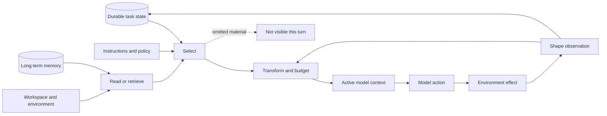
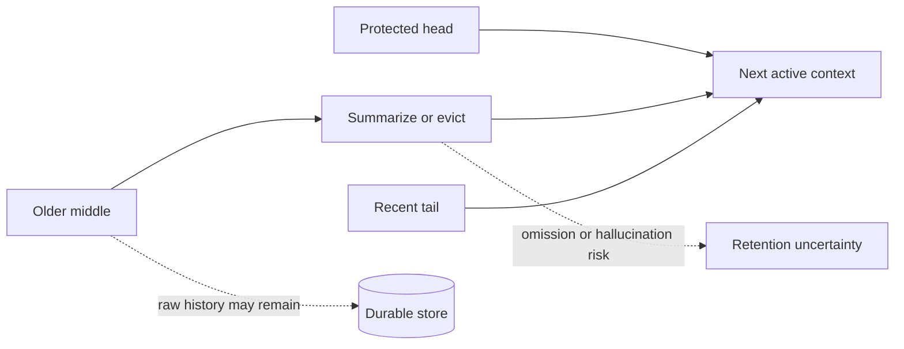

# Designing a Context Policy

## Six decisions, four advisors

You are building a harness for a long-running coding agent. The model is chosen, the tools work, and now you face the decisions that will quietly determine most of your agent's failures: **what does the model get to see, and what happens to everything else?**

Industry writing calls this discipline **context engineering**. This chapter runs it as a working session. You will make six decisions in order. At each one you will hear from four advisors—Pi, OpenHands Software Agent SDK, OpenClaw, and Hermes Agent, each pinned and reviewed at an exact commit—plus two consultants brought in for specific questions (Codex CLI and Letta, pinned bounded inspections) and one rumor from a closed shop (Claude Code, source-reported only). At the end of each decision, you write your answer down. By the chapter's end you will have a **context contract**: the document most harnesses never write and then wish they had.

Your design canvas is the pipeline every advisor implements some version of:

The model receives only the output of selection and transformation—never the durable transcript, workspace, memory store, or raw environment. Every decision below chooses what that pipeline keeps, spends, and discards. ([Context synthesis C001](../../research/claims/context-management-across-harnesses.md#c001), [C002](../../research/claims/context-management-across-harnesses.md#c002))

> **Common confusion — persistence is not model awareness.**
>
> Throughout this session, "we stored it" and "the model can use it now" are different claims. Design as if the distance between them is where your bugs will live—because it is.

## Decision 1: What enters before the agent asks for anything?

**The question.** Which instructions, tools, skills, files, and environment facts enter every call automatically—and how does each one go stale?

**How the field decided.** Pi assembles working directory, date, active tool guidance, project instruction files, and skill metadata, walking the repository ancestry; skills are advertised by metadata and loaded on demand—**progressive disclosure**, refreshed together with the executable tool set. OpenHands freezes agent policy, materializes it with runtime tool schemas into an inspectable `SystemPromptEvent`, and lets dynamic state flow through the event model. OpenClaw separates a cache-stable prefix from run-specific material, injects bootstrap files by default, and varies the set by route—ordinary runs full, heartbeat and cron lighter or empty. Hermes caches the assembled system prompt for the session and adds request-local material per call, accepting that a mid-session profile update may wait for invalidation.

**What you are trading.** Rebuild aggressively and you buy freshness with cost and prompt variability. Cache aggressively and you buy stability with stale snapshots. Advertise resources and you save tokens while betting on well-timed retrieval. Inject everything and you avoid retrieval misses while crowding attention. ([Context synthesis C003](../../research/claims/context-management-across-harnesses.md#c003))

> **Write it down.** For your harness: What is in every call? What is per-session, per-route? What must be retrieved? What invalidates each cached element—and does the model know how fresh its picture is?

Exact implementation anchors for initial construction

- Pi: active-tool, instruction-file, skills-metadata, and extension-refresh assembly in [CP2-S001-E04](../../research/sources/cp2-pi-v0.80.6.md#evidence-items-and-claim-references)
- OpenHands: frozen agent policy materialized with runtime tools, plugins, skills, MCP, and the model view in [CP2-S002-E06](../../research/sources/cp2-openhands-sdk-v1.35.0.md#evidence-items-and-claim-references)
- OpenClaw: per-run materialization of provider, prompt, bootstrap, skills, context-engine state, and the effective tool set in [CP2-S005-E07](../../research/sources/cp2-openclaw-v2026.6.6.md#evidence-items-and-claim-references)
- Hermes: session-cached system prompt with request-local additions and restore-or-rebuild invalidation in [CP2-S009-E10](../../research/sources/cp2-hermes-agent-v0.18.2.md#evidence-items-and-claim-references)
- Status: verified implementation facts for the assembly and caching paths; the staleness tradeoff framing is inference

## Decision 2: How does the agent acquire what it is missing?

**The question.** When the agent needs a 10,000-line file or a long log, what window does it get, and what continuation exists?

**How the field decided.**

| Advisor | File reads | Shell / bootstrap |
| --- | --- | --- |
| Pi | First 2,000 lines and 50 KB, offset to continue | Shell keeps the *last* 2,000 lines and 50 KB; full output spills to a temporary file |
| OpenHands | Caller-selected range, 16,000-character response cap | Terminal observations cap at 30,000 characters; full content may persist when configured |
| OpenClaw | Tool-specific | Bootstrap: 20,000 characters per file, 60,000 aggregate, head-and-tail with warning; live results tiered separately |
| Hermes | 500 lines default, 2,000 max, 100,000 characters, complete-line trim, next offset | Project instructions get a model-window-scaled budget |

Consultants concur on the deeper principle: Codex bounds combined AGENTS files at 32 KiB and ordinary shell output at 10,000 tokens and one MiB per process; Letta's shell requests a 10,000-token budget and caps inline output at 30,000 characters while retaining a larger process-local body.

**What you are trading.** Pi's head-for-files, tail-for-commands asymmetry is task-shaped: declarations top, stack traces bottom—and anything mid-file can vanish. OpenHands converts a bad window into a visible retrieval error. The consensus worth stealing: **acquisition is typed by source**—files, shell output, bootstrap instructions, and observations do not deserve one universal truncation rule.

> **Common confusion — "the model has a 200K window" does not mean the harness will send 200K of this result.**
>
> Every advisor reserves capacity for instructions, history, schemas, and output, and caps single sources so none monopolizes attention.

> **Write it down.** For each source type in your harness: window shape (head, tail, range), byte and line budgets, continuation mechanism, and who chooses the window—the model, the caller, or the policy.

## Decision 3: What does the model learn about what just happened?

**The question.** An 80,000-character build fails with the decisive assertion at character 53,000. What reaches the next call?

**How the field decided.** Pi keeps the tail and names the temp file holding everything—visible loss, recovery handle—and fails tool calls whose arguments a provider may have truncated rather than executing them. OpenHands converts output into a typed, capped observation inside the durable event tree; the transformer is powerful and therefore dangerous—a lossy conversion writes a clean record of the wrong evidence. OpenClaw maintains three representations (canonical transcript, bounded provider clone, recovery-time rewrite), caps live results by tier at 16K/32K/64K characters under a 30-percent window share, and preserves head plus a diagnostic-looking tail with an omission marker. Hermes spills big bodies to disk and returns a 1,500-character preview (the pinned default) plus the path—full recoverability, behavioral risk.

**What you are trading.**

| Policy | You gain | You silently risk | Recovery cost |
| --- | --- | --- | --- |
| Head | setup, schema, declarations | the final error | paginate later |
| Tail | the final error | the initial cause | inspect the spill |
| Head + tail | both boundaries | the decisive middle | targeted retrieval |
| Preview + path | full recoverability | evidence never fetched | one more call, judged well |
| Typed observation | structure and status | conversion losses | raw artifact, if retained |

There is no context-free winner; a good policy is output-aware, makes omission obvious, preserves a route back, and **tests whether the route is used**. ([Context synthesis C004](../../research/claims/context-management-across-harnesses.md#c004))

> **Write it down.** For each tool: the representation the model sees, the omission marker, the recovery handle, and the test that proves the handle gets used under pressure.

Exact implementation anchors for result shaping

- Pi: exact head/tail limits, continuation, and spill behavior in [CP2-S001-E12](../../research/sources/cp2-pi-v0.80.6.md#evidence-items-and-claim-references)
- OpenHands: exact file/terminal caps and persistence condition in [CP2-S002-E15](../../research/sources/cp2-openhands-sdk-v1.35.0.md#evidence-items-and-claim-references), plus the typed action/observation boundary in [CP2-S002-E08](../../research/sources/cp2-openhands-sdk-v1.35.0.md#evidence-items-and-claim-references)
- OpenClaw: exact bootstrap and live-result budgets in [CP2-S005-E21](../../research/sources/cp2-openclaw-v2026.6.6.md#evidence-items-and-claim-references), plus canonical/provider/recovery projections in [CP2-S005-E10](../../research/sources/cp2-openclaw-v2026.6.6.md#evidence-items-and-claim-references)
- Hermes: exact read, per-result, aggregate, preview, and spill limits in [CP2-S009-E26](../../research/sources/cp2-hermes-agent-v0.18.2.md#evidence-items-and-claim-references)
- Status: verified implementation facts; information-value tradeoffs are engineering inference

## Decision 4: Which history is live?

**The question.** Your durable record and your model-visible history are different objects. What is each, and what maps one to the other?

**How the field decided.** Pi keeps append-only JSONL session trees; the model view follows the active leaf, so a call reasons over a path, not everything stored. OpenHands separates three answers cleanly—the event log says what happened, the branch head says what is current, the never-persisted `View` says what the model may see. OpenClaw runs a federation of stores with different durability and recovery rules and projects a repaired view; "OpenClaw persists the conversation" is not a meaningful sentence until you name the store. Hermes holds sessions in SQLite, where compression soft-archives old rows and inserts the compacted projection atomically under the same session ID—original rows stay searchable.

**What you are trading.** Projection buys auditability, branching, and recovery at the price of a mapping that can drift. **All four advisors store more than the model receives**—the design question is whether your projection is deterministic, testable, and explainable after an incident. ([Context synthesis C002](../../research/claims/context-management-across-harnesses.md#c002))

> **Write it down.** Name the source of truth. Define the projection rule. Decide how you would replay the exact model view from durable state after a bad night.

## Decision 5: What happens when it stops fitting?

**The question.** Sessions outgrow windows. When yours does, what is protected, what is transformed, and—above all—what happens when the transformation fails?

**How the field decided.** Pi compacts by default—16,384 reserved tokens, 20,000-token recent region, legal-boundary walk, structured summary folding in the previous one, appended file lists—and bounds overflow recovery to one compact-and-retry. OpenHands makes condensation optional at the constructor and opinionated in the preset (80 events, keep first four; generic defaults differ), records a durable condensation event with the forgotten IDs, and distinguishes soft pressure (may fail without changing the view) from hard (retry smaller, then propagate). OpenClaw compacts inside a liveness envelope—raised reserve floor, overflow and timeout detection, bounded retries, resume-from-transcript, last-resort persisted truncation, then reset guidance. Hermes compresses in place near 50 percent, protects the system prompt plus early messages (protection decays after the first pass) and a recent region, prunes old tool payloads, soft-archives rows—and, by default (`abort_on_summary_failure=false`), survives an ordinary summarizer failure by inserting a deterministic lossy placeholder, while preserving history on auth and network failures.

| Advisor | On failure or persistent pressure | Implied priority |
| --- | --- | --- |
| Pi | bounded retry, then stop | predictable termination |
| OpenHands | soft may hold the view; hard retries then propagates | optimization ≠ recovery |
| OpenClaw | escalate, then reset guidance | service liveness |
| Hermes | lossy continuation by default, raw rows preserved | forward progress |

Codex compacts automatically at 90 percent of its effective window and warns that repeated compaction can reduce accuracy—an advisor admitting a cost in writing. Letta's server defaults to a sliding-window summarizer and keeps older conversation searchable, refusing to make the summary the only road back.

> **Common confusion — a fluent summary reads as complete.**
>
> Truncation announces itself; a summary that silently dropped one requirement does not. Your failure posture will matter more than your summarizer prompt.

**What the research warns.** Semenov and Dorofeev call LLM-summary compaction potentially lossy, blocking, destructive, and hallucination-prone (one long run of evidence). Cim and collaborators measured compaction at up to 62 percent of wall time in low-threshold settings with semantically varying ten-run summaries—on other tasks and stacks. Status for your design review: **contested implementation practice**—widely shipped, plausibly useful, unmeasured at these pins. Do not let anyone on your team call it solved. ([Context synthesis C005](../../research/claims/context-management-across-harnesses.md#c005), [C009](../../research/claims/context-management-across-harnesses.md#c009))

> **Write it down.** Trigger threshold. Protected regions. Legal cut points and tool-pair integrity. Raw-history retention. And a one-line answer per failure: summarizer down, summary too big, pressure persists—hold, retry, degrade, or stop?

Exact implementation anchors for compaction defaults and failure posture

- Pi: trigger, protected recent region, structured summary, and defaults in [CP2-S001-E12](../../research/sources/cp2-pi-v0.80.6.md#evidence-items-and-claim-references)
- OpenHands: bare-agent versus preset defaults and the 80-event/four-event policy in [CP2-S002-E15](../../research/sources/cp2-openhands-sdk-v1.35.0.md#evidence-items-and-claim-references)
- OpenClaw: runtime compaction and bounded recovery in [CP2-S005-E08](../../research/sources/cp2-openclaw-v2026.6.6.md#evidence-items-and-claim-references)
- Hermes: threshold, protected regions, pruning, soft archival, and summary-failure split in [CP2-S009-E26](../../research/sources/cp2-hermes-agent-v0.18.2.md#evidence-items-and-claim-references)
- Status: verified implementation facts; the stated priorities and semantic-retention risks are engineering inferences

## Decision 6: What crosses to a child agent?

**The question.** Delegation creates a new projection boundary. What crosses it?

**How the field decided.** Isolation dominates the defaults: Pi's example extension sends an explicit task to a separate process (no transcript; bounded output back); OpenHands starts a new conversation with the task and a shared workspace (aggregated final text back); OpenClaw isolates unless a same-agent transcript fork is explicitly requested (cross-agent must stay isolated); Hermes gives children fresh sessions—explicit goal, context, workspace; no parent files, no memory, capability no broader than the parent.

Codex proves the choice need not be binary: `fork_turns` accepts `none`, a turn count, or `all`—and even "all" filters tool calls, tool results, reasoning, and non-final assistant work as implementation debris, passing system, developer, and user messages plus final answers. Letta offers stateless ephemeral children (no MemFS, no memory blocks) and an explicit conversation fork.

**What you are trading.** Isolation cuts contamination and cost and creates **brief-writing risk**—every omitted constraint is unavailable unless rediscovered. Inheritance cuts briefing loss and imports irrelevance, staleness, and cost. Codex's filter is a third instructive answer to a hard question: which parts of a trajectory are context, and which are debris—knowing the filter can also discard the one tool result that mattered.

> **Common confusion — a fresh context is not an independent mind.**
>
> If the same parent model writes the brief, executes it, and grades the summary, correlated errors remain likely. ([Context synthesis C006](../../research/claims/context-management-across-harnesses.md#c006))

> **Write it down.** An inheritance policy by role and message type; a handoff contract for briefs; what returns to the parent; and the test comparing child briefs against parent requirements.

## The seventh decision you did not schedule: memory

Your harness will be asked to "remember things." Before agreeing, separate five claims: **history** (recorded), **active context** (visible now), **memory** (meant to survive), **adaptation** (future artifacts change), **optimization** (changes selected by measured outcomes). The advisors implement the first four. None demonstrates the fifth.

OpenClaw retrieves through a memory plugin, can flush durable notes before compaction, and ships disabled-by-default dreaming that promotes repeatedly recalled, diverse material. Hermes updates memory and skills from conversation experience in background processes. Letta prices placement explicitly—always-visible `system/` memory permanently consumes context; other memory must be read; history stays searchable; reflection rewrites committed memory through git-committed, validated MemFS edits. Codex ships cross-run memory as an experimental, disabled-by-default extension.

The promotion signals—recall, diversity, recency, interpretation—are not outcomes; a frequently recalled mistake is promoted as readily as a truth. MemoryAgentBench splits memory into four competencies and finds no evaluated method mastering all; it does not test these harnesses. Design accordingly: provenance on writes, conflict representation, a correction and forgetting path, and no "self-improving" claims without outcome evidence. ([Context synthesis C007](../../research/claims/context-management-across-harnesses.md#c007), [C010](../../research/claims/context-management-across-harnesses.md#c010))

## Design review: attack your own policy

Before shipping, review your six answers against the failures they must survive. Each row is a question for your design, not a feature list:

| Attack | Your policy survives if… |
| --- | --- |
| **Silent omission** | truncation is marked and a recoverable handle exists |
| **Retrieval miss** | required resources are inventoried and their triggers tested |
| **Stale injection** | each cached element has a stated invalidation rule |
| **Projection drift** | the model view can be replayed from durable state |
| **Summary omission** | retention probes test the constraints, not the mechanics |
| **Summary hallucination** | summary facts are checked against durable events |
| **Tool-pair corruption** | action/result pairs are handled atomically |
| **Memory pollution** | writes carry provenance and a forgetting path exists |
| **Child starvation** | briefs are compared against parent requirements |
| **Attention crowding** | you measure task performance by context composition, not fit |

Context failures usually remove the evidence needed to notice them—your review's job is to make that impossible. ([Context synthesis C008](../../research/claims/context-management-across-harnesses.md#c008))

## Your contract, assembled

The six write-it-down blocks compose into one document ([Context synthesis C011](../../research/claims/context-management-across-harnesses.md#c011)):

1. **Source of truth** — named per surface, with a winner when stores disagree.
2. **Admission** — every call / per session or route / retrieval only, with invalidation rules.
3. **Transformation** — per source type: selection, budget, window, omission marker, recovery path.
4. **Failure posture** — hold, retry, degrade, or stop, decided before the incident.
5. **Boundary crossing** — what survives calls, crashes, resumes, compactions, spawns, and days.
6. **Retention tests** — proofs that knowledge survives, not that mechanisms ran.

This is an engineering recommendation, not a claim that one contract fits every product. The advisors disagree with each other on nearly every decision above while all shipping working systems—the contract's value is not the answers, it is that yours are written, tested, and deliberate.

## What your advisors can and cannot tell you

They can show you **verified mechanics at exact pins**: every number in this chapter traces to inspected code. They can show you four coherent, different priority orderings—termination, inspectability, liveness, forward progress. They cannot tell you which policy wins on matched long-horizon tasks (unmeasured), how closed harnesses behave (the Claude Code reporting—a 256 KiB pre-read gate, roughly 25,000-token post-read budget, read deduplication, spill-with-preview, working-set restoration—remains source-reported and version-unstable), or whether their similarities are independent convergence (OpenClaw and Hermes share migration and influence links; they are not independent data points). ([Context synthesis C012](../../research/claims/context-management-across-harnesses.md#c012))

## Recap

You made six decisions: what enters, how the missing is acquired, what the model learns about events, which history is live, what happens under pressure, and what crosses to children—plus the memory decision that arrived unscheduled. Four production teams answered the same questions differently and defensibly; your contract is only obliged to be explicit where theirs are implicit.

If you remember one question, make it this:

> **What exact evidence will the model receive on the next call, and what happened to everything else?**

## Reflection questions

1. Which of your six answers did you find hardest to write down—and is that where your next incident is?
2. Which advisor's priority ordering (termination, inspectability, liveness, forward progress) matches your product, and where does it not?
3. What retention test could you add to CI this week?
4. Which single number in your contract are you least confident about, and what experiment would settle it?

## Suggested next reading

- [Agent-grade context synthesis](../../research/syntheses/context-management-across-harnesses.md)
- [Pi case study](../../research/case-studies/pi-v0.80.6.md) · [OpenHands SDK case study](../../research/case-studies/openhands-sdk-v1.35.0.md) · [OpenClaw case study](../../research/case-studies/openclaw-v2026.6.6.md) · [Hermes Agent case study](../../research/case-studies/hermes-agent-v0.18.2.md)
- [Codex CLI bounded context inspection](../../research/sources/codex-cli-v0.144.6-context.md) · [Letta bounded context inspection](../../research/sources/letta-code-v0.28.11-context.md)
