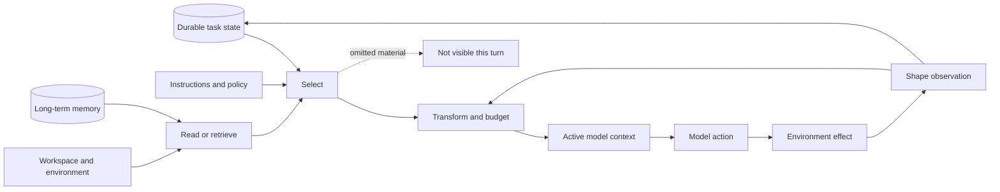
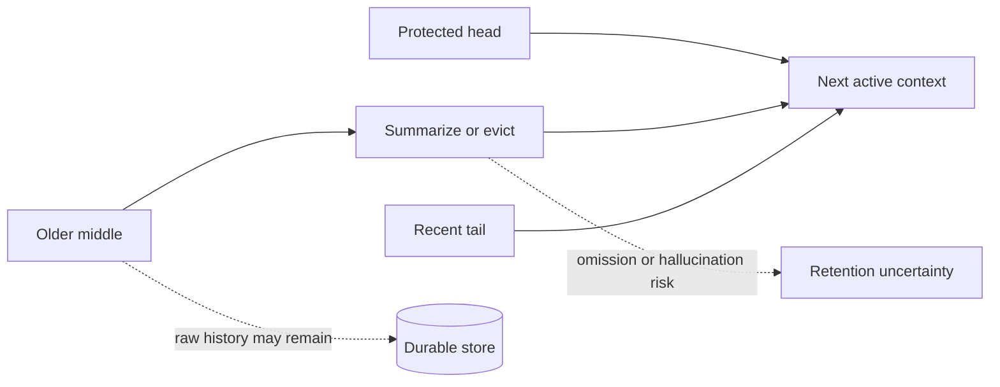

# Context Engineering

## How agent harnesses decide what the model sees

A harness is the software around a language model that turns it into a working agent: it builds the prompts, runs the tools, stores the history, and decides what happens when things fail. This chapter is about the part of that job the industry calls **context engineering**: choosing what enters the model's limited attention on every call, in what form, at what cost.

The chapter is written for engineers who want to build or seriously evaluate a harness. Each section covers one mechanism and follows the same method:

1. **How it works.** The mechanism explained from scratch, then traced through four pinned, reviewed implementations: Pi, OpenHands Software Agent SDK, OpenClaw, and Hermes Agent. Each harness gets its own explanation and its own diagram. Two extra pinned inspections, Codex CLI and Letta, appear where they widen the design space.
2. **What each choice optimizes for.** None of these designs is careless. Each gives something up on purpose, and you need to know what.
3. **What the evidence says.** Verified mechanics at exact commits, research findings with their actual numbers and limits, and an honest "unmeasured" label where the field has shipped ahead of its evidence.
4. **Design guidance.** How to choose, based on your goal.

The final section turns those guidance blocks into a design procedure for your own harness.

> **Common confusion: persistence is not model awareness.**
>
> The most important invariant in this chapter: "we stored it" and "the model can use it now" are different claims. Every mechanism below manages the distance between them.

### The system under discussion

Everything in this chapter is one pipeline. The model never reads the full stored history, the workspace, or the memory database directly. It reads a small artifact assembled from them on every call:

Seven mechanism areas structure that pipeline and this chapter: initial construction, acquisition, observation shaping, history projection, compaction, context transfer, and memory. ([Context synthesis C001](../../research/claims/context-management-across-harnesses.md#c001))

One framing to carry throughout: the four harnesses are four coherent optimization profiles, not four attempts at the same design. Pi is built to be a predictable, auditable interactive coding tool. OpenHands is built as a platform where every step can be inspected and replayed. OpenClaw is built to keep a long-lived, multi-channel personal agent alive. Hermes is built to keep making progress and to adapt across sessions, even when parts of it fail. Their context policies follow from those goals. That is why studying all four teaches you how to design for yours.

## 1. Initial construction: the model's starting world

**The problem.** Before the agent does anything, the harness compiles a starting prompt. Getting this right is harder than it sounds, because the ingredients change at different speeds, and two forces pull against each other: stability (cacheable, predictable, cheap prompts) and freshness (the prompt reflects the actual current world).

First, the ingredients, since the rest of the section depends on them:

- The **system prompt** is the harness-authored instruction block sent with every call. In a real harness it is not a paragraph of personality. It is a compiled document: who the agent is, how it should work, which tools exist and how to use them, and facts about the environment (working directory, date, project).
- **Instruction files** are files a user or team leaves in a repository or config directory to shape the agent, such as an `AGENTS.md` with project conventions. The harness finds them and injects them.
- **Skills** are named packets of instructions for a specific job ("release a version", "review a PR"). They matter here because a harness must decide whether to inject their full text up front or only advertise their names.
- **Tool schemas** are the JSON descriptions of callable tools that the model sees. What the model believes it can do comes entirely from these.

Every harness assembles some mix of these, plus live state, into each call. The design question is where to draw the cache boundary: which parts are compiled once and reused, and which are rebuilt fresh.

### Pi: rebuild between turns, advertise instead of inject

Pi builds its prompt from the working directory, the current date, guidance for each currently active tool, instruction files, and a skills index. Two mechanisms define it.

First, discovery: Pi walks up the directory tree from the working directory and collects instruction files from every ancestor, so repository conventions apply without configuration. Second, **progressive disclosure**: skills enter the prompt as names and one-line descriptions only. The model reads a skill's full text with a file-read call when it decides it needs it. This keeps the prompt small and current, and it bets that the model will ask at the right moment.

Pi refreshes the prompt, the model choice, and the tool list between tool turns, never during one. A change made mid-turn (by the user or by a plug-in) applies cleanly to the next model call. The payoff is coherence: the tool list described in the prompt and the tool list the runtime will actually execute are rebuilt together, so they cannot drift apart.

<figure class="fig-flow" aria-label="Pi prompt assembly flow">
  

    instruction files<small>found by walking ancestor dirs</small>
    skills<small>names + descriptions only</small>
    active tools<small>guidance per tool</small>
    →
    system prompt<small>compiled fresh</small>
    →
    refresh point<small>between tool turns</small>
    →
    model call
  

</figure>

### OpenHands: freeze the policy, record the prompt

OpenHands treats agent configuration as an immutable object. An `Agent` is a frozen record holding the model choice, the tool list, the prompt policy, and optional components. When a conversation starts, the harness materializes that record: it resolves the tool specifications into runnable tools, renders the system prompt, and then stores the rendered prompt and the exact tool schemas *as an event* in the conversation's permanent log (a `SystemPromptEvent`).

That last step is the distinctive move. Most harnesses can tell you what the prompt template is. OpenHands can tell you exactly what prompt any historical call received, because the prompt is data in the same log as everything else. The qualification: plug-ins discovered from the environment are re-resolved when a conversation resumes, and they are not pinned, so a resumed run is not guaranteed to reconstruct the identical capability set.

<figure class="fig-flow" aria-label="OpenHands prompt assembly flow">
  

    frozen Agent config<small>model + tools + prompt policy</small>
    →
    materialize<small>resolve tools, render prompt</small>
    →
    SystemPromptEvent<small>prompt stored in the event log</small>
    →
    model call<small>prompt + current view + schemas</small>
  

</figure>

### OpenClaw: a stable prefix, a changing tail, a different world per route

OpenClaw runs one agent across many channels (Telegram, other chat platforms, scheduled jobs), so its prompt assembly answers a question the others do not have: which parts of the prompt can be reused across calls to keep provider prompt caching cheap, and which parts must change per run?

Its answer is a two-part prompt. The stable prefix holds policy, identity, and **bootstrap files**: workspace files like `AGENTS.md`, `SOUL.md`, `TOOLS.md`, and `MEMORY.md` that define the agent's standing knowledge, injected under per-file and total size budgets. The dynamic tail holds session, channel, and provider details that change per run. On top of that, the injection itself varies by route: a normal message gets the full bootstrap set, a scheduled heartbeat gets a lightweight set, and a cron job gets none. There is no single "OpenClaw prompt"; there is a prompt per route.

One honest detail worth copying: the prompt explicitly warns the model that a tool being described in `TOOLS.md` does not mean the tool is currently available. Documentation and capability are kept separate even inside the prompt.

<figure class="fig-flow" aria-label="OpenClaw prompt assembly flow">
  

    stable prefix<small>policy + identity + bootstrap files</small>
    dynamic tail<small>session + channel + provider</small>
    →
    route policy<small>full / lightweight / none</small>
    →
    model call<small>prefix reused for provider caching</small>
  

</figure>

### Hermes: cache the whole prompt, add per-call extras, invalidate explicitly

Hermes compiles identity, work guidance, project files (selected by priority rules rather than concatenating everything), a filtered skills index, its memory and user-profile files, environment facts, and the date into one system prompt, and then caches that whole prompt for the session. Each call adds per-call extras on top: freshly retrieved memory, plug-in context, and tool schemas. The extras are never written back into stored history; they exist only for that call.

The consequence to understand: once cached, the prompt is a snapshot. If a background process writes a new fact to the memory file mid-session, that fact is durably saved and *not visible to the model* until something rebuilds the prompt. Hermes rebuilds on three explicit triggers: context compression, a model change, and a profile change. This is the stability-versus-freshness trade taken to its stable extreme, with the staleness window as the accepted price.

<figure class="fig-flow" aria-label="Hermes prompt assembly flow">
  

    identity + project files + skills index + memory files
    →
    session cache<small>compiled once, snapshot until invalidated</small>
    →
    per-call extras<small>retrieved memory + plugin context + schemas</small>
    →
    model call
  

  
Cache invalidated by: compression · model change · profile change. A memory write between invalidations is stored but not visible.

</figure>

### Summary and tradeoffs

<figure class="fig-stack" aria-label="Prompt assembly layers across four harnesses">
  <figcaption><strong>The same three layers, four different cache boundaries.</strong></figcaption>
  

    
Stable / cacheableidentity · policy · tool guidance

    
Session-scopedproject instructions · skills index · environment · memory snapshot

    
Per-callhistory · retrieved memory · plugin context · tool schemas

  

  
Pi rebuilds at every turn boundary. OpenHands freezes policy and records the rendered prompt. OpenClaw reuses a stable prefix and varies the tail by route. Hermes caches everything for the session and adds per-call extras.

</figure>

| Harness | Optimizes for | Accepts in exchange |
| --- | --- | --- |
| Pi | The tools described in the prompt always match the tools the runtime can execute; skills cost nothing until used | Skill details arrive only if the model asks for them; plug-ins that change tools or prompts directly reshape what the model sees |
| OpenHands | Any historical call can be reconstructed exactly, because the rendered prompt is stored as data | Environment-discovered plug-ins are re-resolved on resume, so a resumed run may differ from the original |
| OpenClaw | Cheap provider prompt caching; each route (chat, heartbeat, cron) gets an appropriately sized world | Reasoning about behavior requires knowing which route ran; there is no single canonical prompt |
| Hermes | Maximum prompt stability across a session; per-call additions stay flexible | New memory or profile writes are invisible until an explicit invalidation rebuilds the prompt |

### What the evidence says

*Verified at the pins:* every assembly path and cache boundary above. ([Context synthesis C003](../../research/claims/context-management-across-harnesses.md#c003))

*Research:* no admitted study measures prompt-assembly policies directly. The nearest evidence is SWE-agent's 2024 experiments, which showed that interface and instruction presentation choices materially changed coding outcomes under its models. That supports treating these choices as consequential. It does not rank the four designs.

*Unmeasured, and how you would measure it:* staleness cost (instrument the gap between a state write and its first model-visible appearance, and correlate with task errors) and retrieval-miss rate for progressive disclosure (trace tasks where a needed skill or instruction file was never loaded).

### Design guidance

Choose the cache boundary from your session shape. Short interactive sessions tolerate Pi-style rebuilding, since freshness is cheap when prompts are small. Long-lived services with provider prompt caching want OpenClaw's stable-prefix discipline; measure your cache hit rate, because it is real money. If you must be able to reconstruct any historical call (debugging, compliance, research), OpenHands' stored-prompt design is the only one here that makes that trivial. If you cache like Hermes, write the invalidation rules first. Every cached element needs a stated trigger, or you have designed a staleness bug.

Exact implementation anchors for initial construction

- Pi: active-tool, instruction-file, skills-metadata, and refresh assembly in [CP2-S001-E04](../../research/sources/cp2-pi-v0.80.6.md#evidence-items-and-claim-references)
- OpenHands: frozen agent policy materialized with runtime tools, plugins, skills, MCP, and the model view in [CP2-S002-E06](../../research/sources/cp2-openhands-sdk-v1.35.0.md#evidence-items-and-claim-references)
- OpenClaw: per-run materialization of provider, prompt, bootstrap, skills, context-engine state, and the effective tool set in [CP2-S005-E07](../../research/sources/cp2-openclaw-v2026.6.6.md#evidence-items-and-claim-references)
- Hermes: session-cached system prompt with request-local additions and restore-or-rebuild invalidation in [CP2-S009-E10](../../research/sources/cp2-hermes-agent-v0.18.2.md#evidence-items-and-claim-references)
- Status: verified implementation facts for the assembly and caching paths; the staleness and cache-boundary tradeoff framing is inference

## 2. Acquisition: reading a world larger than the window

**The problem.** The agent needs to read files, logs, and pages that are bigger than any sensible budget. So every harness imposes a **window**: a rule for which part of an oversized source actually reaches the model. The shape of that window decides which evidence silently disappears. A window can keep the head (the start), the tail (the end), a caller-chosen range, or a page at a time with an offset for continuing.

### Pi: head for files, tail for commands

Pi's file reader returns the first 2,000 lines or 50 KB, whichever limit is hit first, and never returns a partial line. Its shell tool does the opposite: it keeps the *last* 2,000 lines or 50 KB and writes the complete output to a temporary file whose path the model is told. The asymmetry is deliberate and task-shaped. File declarations and structure live near the top; compiler errors and stack traces end at the bottom. The model can continue a file read with an offset. Anything in the middle of a long file, or the start of a long build log, is invisible unless the model goes back for it.

<figure class="fig-flow" aria-label="Pi read and shell window flow">
  

    read(file)
    →
    keep head<small>2,000 lines / 50 KB, whole lines only</small>
    →
    model sees head + "use offset to continue"
  

  

    bash(cmd)
    →
    keep tail<small>2,000 lines / 50 KB</small>
    →
    full output<small>written to temp file</small>
    →
    model sees tail + file path
  

</figure>

### OpenHands: the caller picks the range

OpenHands' file editor takes an explicit line range from its caller and caps the response at 16,000 characters. There is no default head or tail heuristic to be wrong. Instead, choosing a bad window becomes a visible mistake the model can correct with a new range, rather than a silent truncation it never learns about. Terminal output gets a 30,000-character cap on what the model sees, with the full output optionally persisted to disk.

<figure class="fig-flow" aria-label="OpenHands range read flow">
  

    edit/view(file, lines 400..900)
    →
    selected range<small>capped at 16,000 chars</small>
    →
    model sees the range it asked for
    →
    wrong range?<small>ask again with a new range</small>
  

</figure>

### OpenClaw: different budgets for different kinds of content

OpenClaw's sharpest acquisition idea is that instruction content and data content deserve different rules. Its bootstrap files (the standing instruction files from section 1) have their own budgets: 20,000 characters per file and 60,000 in total, and an oversized file is cut to 75 percent head and 25 percent tail with an always-on warning marker showing where the cut happened. Live tool results are governed by a completely separate rule described in section 3. Instructions are protected as a class, not fought over call by call.

<figure class="fig-flow" aria-label="OpenClaw bootstrap budget flow">
  

    bootstrap files<small>AGENTS.md, SOUL.md, MEMORY.md ...</small>
    →
    per-file budget<small>20,000 chars</small>
    →
    total budget<small>60,000 chars</small>
    →
    75% head + 25% tail<small>with visible truncation warning</small>
  

</figure>

### Hermes: pagination as a first-class protocol

Hermes' file reader defaults to 500 lines, allows up to 2,000 lines per call, and caps the response at 100,000 characters. It trims to complete lines and, when it truncates, returns the next offset explicitly. Reading a huge file completely is a supported loop, not a workaround: read, receive the next offset, read again. Project instruction files get a separate budget scaled to the model window.

<figure class="fig-flow" aria-label="Hermes paginated read flow">
  

    read_file(path, offset, limit)
    →
    window<small>500 lines default, 2,000 max, 100K chars</small>
    →
    model sees page + next offset
    →
    repeat until done
  

</figure>

### Summary and tradeoffs

<figure class="fig-windows" aria-label="Read-window shapes across four harnesses">
  <figcaption><strong>The same 10,000-line file under each policy.</strong> Green regions reach the model; faded regions exist only in storage.</figcaption>
  

    
Pi read <small>head</small><i class="keep" style="width:22%"></i><i class="drop" style="width:78%"></i>offset to continue

    
Pi shell <small>tail</small><i class="drop" style="width:78%"></i><i class="keep" style="width:22%"></i>full copy in temp file

    
OpenHands <small>range</small><i class="drop" style="width:30%"></i><i class="keep" style="width:25%"></i><i class="drop" style="width:45%"></i>caller picks the range

    
OpenClaw bootstrap <small>head + tail</small><i class="keep" style="width:30%"></i><i class="drop" style="width:55%"></i><i class="keep" style="width:15%"></i>visible warning at the cut

    
Hermes <small>pages</small><i class="keep" style="width:38%"></i><i class="drop" style="width:62%"></i>next offset returned

  

</figure>

Head windows optimize for understanding structure. Caller-chosen ranges optimize for deliberate navigation and make window mistakes visible. Separate budgets per content type optimize for protecting instructions from data. Pagination optimizes for completeness at the price of extra turns. Codex and Letta agree on the underlying principle: Codex gives instruction files (32 KiB) and shell output (10,000 tokens and one MiB per process) separate rules; Letta caps inline shell output at 30,000 characters while keeping a larger copy outside the prompt. No inspected system uses one universal truncation rule. **Acquisition is typed by source.**

> **Common confusion: a 200K model window does not mean the harness sends 200K of this file.**
>
> Capacity is reserved for instructions, history, schemas, and the model's own output. Local caps stop any single source from monopolizing attention. A bigger window loosens the budgets; it does not remove them.

### What the evidence says

*Verified at the pins:* every number and window shape above. *Research:* SWE-agent's interface ablations are again the strongest available signal that observation-interface design changes outcomes; they predate and do not rank these designs. *Unmeasured:* how often the decisive evidence sits in a dropped region, and how often models actually continue paginated reads. Both are cheap to instrument: log window positions against where the agent eventually found its answer. ([Context synthesis C004](../../research/claims/context-management-across-harnesses.md#c004))

### Design guidance

Type your budgets by source from day one; it is the one practice every inspected system shares. Pick window shapes per content type: head for code, tail for command output, ranges for model-driven navigation. If your tasks bury evidence mid-file (generated logs, data dumps), a pagination protocol beats a bigger window, because the model needs a way to be *complete*, not just more room. Always keep the remainder reachable. The window is a policy; the stored full copy is the safety net.

## 3. Observation shaping: what happened versus what the model was told

**The problem.** A tool ran and something happened in the world. The model will only ever see a *representation* of it, produced by the harness. That representation is an evidence policy. It decides whether the model learns the truth, a summary of the truth, or a well-formatted fragment that happens to omit the decisive line.

The running example for this section: a build produces 80,000 characters of output, and the only failing assertion sits near character 53,000, in the middle.

### Pi: visible loss, recoverable copy, and a fail-closed action boundary

For our build, Pi keeps the tail (where most build tools print their verdict) and writes the complete output to a temporary file whose path appears in the result. The loss is visible and the recovery route is explicit; using it costs the model another read call.

Pi extends the same integrity thinking to the *input* side of tools. If a provider cuts off a response mid-stream so that a tool call's arguments may be incomplete, Pi refuses to execute every tool call in that response and asks the model to reissue them. A truncated argument could change the action (imagine a path with its last directory missing), so the safe move is to not act at all. Hermes independently implements the same rule.

<figure class="fig-flow" aria-label="Pi observation flow">
  

    80K build output
    →
    keep tail<small>2,000 lines / 50 KB</small>
    →
    full copy<small>temp file, path in result</small>
    →
    model sees tail + path<small>error at char 53,000 is in the file, not the prompt</small>
  

</figure>

### OpenHands: every result becomes a typed record

OpenHands routes every tool result through a typed conversion. The executor's raw output becomes an `Observation` object; the terminal version adds the working directory, the interpreter, and the exit status; large output is truncated to 30,000 characters, with the full version optionally saved. That object is wrapped in an event, appended to the permanent log, and only then converted into the message the model sees.

The benefit is instrumentation and consistency: every observation has structure, status, and a durable record. The risk concentrates in the converter: if the conversion drops the decisive line, the durable log now contains a clean, well-formed record of incomplete evidence. Even interruption respects the record: when a run is interrupted, OpenHands writes error observations for any tool calls left hanging, so the history never contains a call without a result.

<figure class="fig-flow" aria-label="OpenHands observation flow">
  

    raw executor output
    →
    typed Observation<small>+ cwd + exit status, truncate at 30K</small>
    →
    ObservationEvent<small>appended to permanent log</small>
    →
    to_llm_message()<small>what the model sees</small>
  

</figure>

### OpenClaw: three representations of one result

OpenClaw keeps separate representations for separate audiences. The canonical transcript stores the fullest version of the result. The provider gets a bounded clone: capped at 16,000, 32,000, or 64,000 characters depending on the model's window size, and never more than 30 percent of the window, so one result cannot crowd out everything else. And during overflow recovery only, a persisted rewrite can shrink the stored version itself, as a last resort to keep the session alive.

The cap normally keeps the beginning of a result. But a detector scans the tail for error language, stack traces, closing JSON, and summary-like phrasing, and when the tail looks diagnostic it keeps head plus tail with an explicit middle-omission marker. For our build failure at character 53,000: if the tail contains the failure summary, the model sees it; the middle stays in the canonical transcript.

<figure class="fig-flow" aria-label="OpenClaw observation flow">
  

    80K result
    →
    canonical transcript<small>fullest stored version</small>
    →
    provider clone<small>16/32/64K by tier, ≤ 30% of window, diagnostic-tail detection</small>
    →
    model sees head + marked gap + diagnostic tail
  

  
Overflow recovery only: a persisted rewrite may shrink the stored version too. Liveness can become a durability decision.

</figure>

### Hermes: spill the body, show a preview, order the writes

Hermes budgets results individually and per turn. Our 80K build exceeds both, so the full body is written to a scratch directory and the model receives a 1,500-character preview plus the file path; reading more is one `read_file` call away. Post-processing can also add guardrail guidance and navigation hints before the message is appended.

Hermes also treats *when* things are written as part of correctness. The assistant's tool-call block is persisted before the tool runs, and each result is persisted right after it completes. A crash can never leave stored history claiming an action that did not happen, or missing one that did.

<figure class="fig-flow" aria-label="Hermes observation flow">
  

    80K result
    →
    over budget?<small>per-result and per-turn checks</small>
    →
    spill to disk<small>full body, readable later</small>
    →
    model sees 1,500-char preview + path
  

  
Write order as a contract: tool-call block persisted → tool runs → result persisted. Crash-safe at every step.

</figure>

### Summary and tradeoffs

<figure class="fig-fates" aria-label="Four fates of one oversized tool result">
  <figcaption><strong>One 80,000-character failure, four representations.</strong> What reaches the model (solid) and where the complete result survives (outlined).</figcaption>
  

    
Pilast 2,000 lines / 50 KBcomplete copy in temp file, path shown

    
OpenHandstyped observation ≤ 30,000 charsfull content persisted when configured

    
OpenClawhead + diagnostic tail, ≤ 30% of windowfuller canonical transcript entry

    
Hermes1,500-char preview + spill pathcomplete body on disk, tool-readable

  

</figure>

| Harness | Optimizes for | Failure mode accepted |
| --- | --- | --- |
| Pi | Integrity at the action boundary; loss that is visible and recoverable | The model must notice the spill pointer and act on it |
| OpenHands | Structured, instrumented, provider-independent observations | A bad conversion produces a clean record of wrong evidence |
| OpenClaw | Small provider payloads without rewriting stored history | The recovery path can make a temporary loss permanent |
| Hermes | Protecting the next call while keeping everything recoverable | The model may treat the preview as sufficient and never fetch the body |

### What the evidence says

*Verified at the pins:* all mechanisms above, including both independent fail-closed rules for truncated tool-call arguments. *Research:* nothing directly tests shaping policies; SWE-agent supports the general claim that interface choices matter. The structural risk is well characterized in this project's synthesis: shaping failures exhibit **asymmetric observability**, meaning the failure removes the very evidence the model would need to notice it. That is why omission markers and recovery routes matter more than cap sizes. *Unmeasured:* how often models follow preview and spill pointers, and the precision of OpenClaw's diagnostic-tail detector. Both are instrumentable in production. ([Context synthesis C004](../../research/claims/context-management-across-harnesses.md#c004), [C008](../../research/claims/context-management-across-harnesses.md#c008))

### Design guidance

Three rules apply regardless of goal: mark every omission, keep the complete result somewhere the agent can reach, and fail closed on truncated tool arguments (two systems converged on this independently; treat it as settled defensive practice). Then choose by operational profile: typed observations if you need instrumentation and provider independence; preview-plus-spill if outputs are huge and your model retrieves reliably; head-plus-diagnostic-tail if latency budgets rule out retrieval round-trips. Then test the behavioral half. A recovery route the model never takes is a comfort, not a mechanism.

Exact implementation anchors for result shaping

- Pi: exact head/tail limits, continuation, spill, and fail-closed truncated-call behavior in [CP2-S001-E12](../../research/sources/cp2-pi-v0.80.6.md#evidence-items-and-claim-references)
- OpenHands: exact file/terminal caps and persistence condition in [CP2-S002-E15](../../research/sources/cp2-openhands-sdk-v1.35.0.md#evidence-items-and-claim-references), plus the typed action/observation boundary in [CP2-S002-E08](../../research/sources/cp2-openhands-sdk-v1.35.0.md#evidence-items-and-claim-references)
- OpenClaw: exact bootstrap and live-result budgets in [CP2-S005-E21](../../research/sources/cp2-openclaw-v2026.6.6.md#evidence-items-and-claim-references), plus canonical/provider/recovery projections in [CP2-S005-E10](../../research/sources/cp2-openclaw-v2026.6.6.md#evidence-items-and-claim-references)
- Hermes: exact read, per-result, aggregate, preview, and spill limits in [CP2-S009-E26](../../research/sources/cp2-hermes-agent-v0.18.2.md#evidence-items-and-claim-references)
- Status: verified implementation facts; information-value tradeoffs are engineering inference

## 4. History projection: the stored record versus the active view

**The problem.** A long session accumulates far more than any call can carry: every message, every tool result, every wrong turn. Every harness therefore maintains two distinct objects. The **durable history** is the permanent record of what happened. The **active view** (or projection) is the subset assembled for the next model call. Auditability, crash recovery, and branching all live in the mapping between them.

<figure class="fig-branch" aria-label="Durable tree with active-branch projection">
  <figcaption><strong>The projection boundary.</strong> Storage keeps everything, including abandoned branches and pre-compaction entries. The model receives one traversal of it.</figcaption>
  

    
e1e2e3′ abandoned branch

    
e1e2Σ summarye9e10 · active leaf

  

  
Model view = the active leaf's path, the latest summary, the retained tail, and later events. Everything else is storage: recoverable, searchable, invisible.

</figure>

**Pi** stores each session as an append-only tree in a JSONL file. Every entry names its parent, and messages, model changes, compactions, and plug-in entries are all distinct entry types. Moving the active leaf creates a new branch without deleting the old one, so "undo" is really "branch"; nothing is lost, and a human can audit every path taken. The projection function walks from the active leaf and, after a compaction, returns the summary entry plus the kept recent entries and everything since.

**OpenHands** separates three questions into three objects: the append-only event log answers *what happened* (one JSON file per event, each naming its parent); a leaf pointer answers *what is current*; and the `View`, which is computed and never stored, answers *what the model may see*. The `View` admits only model-convertible events on the active branch, applies condensation, and enforces pairing rules such as "no tool call without its result." Because the view is derived, it can be rebuilt from the log at any time, which is what makes crash recovery and replay routine.

**OpenClaw** runs a federation of stores rather than one: an ingress queue in SQLite, delivery offsets, a session registry written atomically, an append-only transcript that is *repaired* on open (older or corrupt state normalized, tool pairing guarded), workspace files, and in-process buffers. Each store has its own durability rules because each answers a different failure: "accepted", "persisted", "completed", and "delivered" are genuinely different events in a multi-channel service. The projection is built from the repaired transcript, never the raw stores.

**Hermes** keeps everything in SQLite: sessions, messages, usage, tool metadata. Append operations are idempotent (safe to retry after a crash without duplicating), and the write ordering from section 3 makes the record trustworthy at every instant. Compression archives old rows and inserts the compacted view atomically under the same session ID, so the active view shrinks while the archive stays queryable forever.

### What each choice optimizes for

Pi's tree buys branching and human audit with minimal machinery. OpenHands' event sourcing buys replay and analysis: any historical state can be reconstructed. OpenClaw's federation buys independent failure domains for a service that must survive partial failure. Hermes' single database buys operational simplicity with strong guarantees: one substrate, atomic transitions, nothing destroyed.

### What the evidence says

*Verified at the pins:* all structures and invariants above. *Research:* the strongest implementation evidence in this chapter. The OpenHands technical report describes a 15-day parallel production rollout with a **61 percent reduction in system-attributable errors** after the event-sourced redesign, and **sub-millisecond median per-event persistence** in a replay of 39,870 events. Read it carefully: the numbers are author-reported, cover a version family broader than this pin, and the rollout changed several things at once. It supports the plausibility of event-sourced designs in production; it is not a controlled ablation. *Unmeasured:* projection determinism under faults, which you can test mechanically: replay the stored history and assert the identical model view. ([Context synthesis C002](../../research/claims/context-management-across-harnesses.md#c002))

### Design guidance

Make this decision first, because everything else composes with it. If forensics, compliance, or agent research matter, event-source: the replay property is priceless in debugging and the production signal, with its limits, is favorable. If you run a multi-channel service, accept the federation and name every commit boundary explicitly; OpenClaw's lesson is that pretending a turn is one transaction creates hidden loss windows, while naming the boundaries lets each be hardened. If you want simplicity with strong recovery, copy Hermes: one database, idempotent appends, explicit write ordering, soft archival. In every case, write the projection as a pure function of durable state, and test it as one.

## 5. Compaction: when the history no longer fits

**The problem.** Eventually the projected history exceeds the window and something must shrink it. Compaction is the only mechanism in this chapter that deliberately destroys model-visible information the agent may later need. Treat it as a transaction with a failure model, not a feature.

The common shape first, then each implementation:

> **Common confusion: a fluent summary reads as complete.**
>
> Truncation announces itself; a summary that silently dropped one requirement does not. This asymmetry drives the whole section. The failure posture matters more than the summarizer prompt.

### Pi: structured summary, hard anchors, bounded retries

Pi compacts by default. It triggers manually, on overflow, or when the estimated context crosses a reserve threshold (16,384 tokens reserved for the response; a 20,000-token recent region is kept). The compactor walks backward to a legal cut point, never splitting a tool call from its result. It asks a model for a structured summary of the older region, folds any previous summary into the new one, and appends two lists that act as hard anchors against drift: files read and files modified. Overflow recovery may compact and retry exactly once. There is no path that loops compaction forever.

<figure class="fig-flow" aria-label="Pi compaction flow">
  

    threshold crossed<small>reserve 16,384 · keep 20,000 recent</small>
    →
    legal cut point<small>never splits tool pairs</small>
    →
    structured summary<small>+ files read + files modified</small>
    →
    new view<small>summary + recent tail</small>
  

  
On overflow: compact and retry once. On repeated failure: stop. Old tree stays stored.

</figure>

### OpenHands: forgetting is an audited event

A bare OpenHands `Agent` has no compaction at all; the recommended preset installs a summarizing condenser with an event-count policy (at most 80 events, keeping the first four). What is distinctive is the record: condensation writes a durable event containing the summary *and the IDs of every forgotten event*. The log shows exactly what was forgotten and when, which no other harness here records. Pressure comes in two grades: soft pressure (event count) may fail without changing the view; hard pressure (token limits) retries with progressively smaller input, then propagates failure to the caller.

<figure class="fig-flow" aria-label="OpenHands condensation flow">
  

    pressure<small>80-event soft limit or token hard limit</small>
    →
    summarize middle<small>keep first 4 + recent suffix</small>
    →
    Condensation event<small>summary + forgotten IDs, in the log</small>
    →
    new view
  

  
Soft failure: keep the current view. Hard failure: retry smaller, then propagate.

</figure>

### OpenClaw: compaction inside a liveness envelope

OpenClaw treats context pressure as one of many things that must not kill a long-lived service. The runtime raises its compaction reserve, watches for overflow and high-context timeouts, bounds retry counts, extends the timeout once if compaction is already running, resumes from the transcript without replaying the user's message, and can shrink stored tool results as a last resort before giving up with guidance to reset the session. An optional pre-compaction step lets the model write durable memory notes before the middle disappears.

<figure class="fig-flow" aria-label="OpenClaw compaction and recovery flow">
  

    overflow or timeout
    →
    optional memory flush<small>save notes before losing the middle</small>
    →
    compact + bounded retries<small>resume without replaying input</small>
    →
    last resort<small>shrink stored tool results</small>
    →
    keep the session alive<small>or advise a reset</small>
  

</figure>

### Hermes: early trigger, cheap losses first, keep moving

Hermes compresses in place at 50 percent of the effective window, the earliest trigger in this set: more headroom, more frequent summarization. Before anything lossy happens it takes the cheap wins deterministically, pruning old tool output and oversized call arguments. It protects the system prompt, the first three non-system messages, and a recent region (the early-message protection expires after the first compression so old turns do not stay pinned forever), then asks a second model for a structured summary of the middle. Old rows are archived, the new view inserted atomically.

The failure policy is split explicitly. Login and network failures preserve history untouched. An ordinary summarizer failure, under the default setting, drops the middle and inserts a fixed placeholder marking the gap, and the session continues. Operators can flip one flag to make every failure preserve history instead. Repeated compression triggers a quality warning.

<figure class="fig-flow" aria-label="Hermes compression flow">
  

    50% of window reached
    →
    deterministic pruning<small>old tool output, oversized args</small>
    →
    protect<small>system prompt + early messages + recent tail</small>
    →
    summarize middle<small>second model</small>
    →
    archive rows, insert new view atomically
  

  
Summarizer fails: continue with a marked gap (default) or abort and preserve (one flag). Network/auth fails: always preserve.

</figure>

### Summary: the failure-posture spectrum

Codex compacts automatically at 90 percent of its window, keeps recent real user messages within a 20,000-token budget locally (64,000 in its remote path), and warns in the product that repeated compaction can reduce accuracy. Letta's server defaults to sliding-window summarization with a separate cheap summarizer model, and keeps everything older searchable, so the summary is never the only way back.

<figure class="fig-posture" aria-label="Compaction failure postures across six systems">
  <figcaption><strong>When the compression transaction is uncertain, what does each system protect?</strong></figcaption>
  

    preserve context <small>stop / hold</small>
    
      <b>Pi</b><small>bounded retry, then stop</small>
      <b>OpenHands</b><small>soft holds view; hard propagates</small>
      <b>Letta</b><small>summarize, keep history searchable</small>
      <b>OpenClaw</b><small>escalate, truncate, reset guidance</small>
      <b>Hermes</b><small>marked gap, keep going</small>
    
    forward progress <small>degrade / continue</small>
  

  
Codex sits near OpenClaw and Hermes: automatic compaction with an explicit accuracy warning. Positions reflect default failure posture at the pins, not quality.

</figure>

Pi protects predictable termination: an interactive tool should stop cleanly rather than degrade invisibly. OpenHands protects inspectability: forgetting is audited, and optional pressure is architecturally distinct from mandatory pressure. OpenClaw protects liveness: a service users depend on must keep moving. Hermes protects forward progress with a recoverable archive: for an autonomous agent, halting on a summarizer hiccup is worse than continuing past a marked gap.

### What the evidence says

This is where the research is most direct, and worth reading precisely.

**Semenov and Dorofeev (2026)** characterize LLM-summary compaction as unpredictably lossy, structurally destructive, blocking, and prone to introducing hallucinations. Their proposed alternative removes the summarizer entirely: the agent maintains typed episodes with dependencies, and eviction is deterministic. Their evidence so far is one 89-task, 80-million-token session reporting parity with fresh sessions, in a first-release preprint with ablations deferred. Treat it as a credible counter-design and a source of failure hypotheses, not a verdict.

**Cim and colleagues (2026)** measured the standard baseline across four model backbones on two benchmarks: synchronous compaction consumed **up to 62 percent of wall-clock time** at low thresholds, and ten repeated runs produced summaries that varied materially in volume and semantic content, with prompt instructions providing little control. Two transferable warnings: low thresholds are expensive (relevant to Hermes' 50 percent trigger, though never tested on it), and a summary is a random variable, so the agent's post-compaction knowledge differs run to run. Limits: non-coding benchmarks, self-hosted models, not these prompts or protected-region policies.

*Verified at the pins:* every mechanism above. *The honest status:* **contested implementation practice**. Universally shipped, plausibly necessary, exposed to demonstrated general risks, unmeasured for retention at these exact designs. Pi's file-list anchors, Hermes' deterministic pre-pruning, and OpenHands' forgotten-ID records each partially mitigate exactly the risks the papers name; none has published retention numbers. ([Context synthesis C005](../../research/claims/context-management-across-harnesses.md#c005), [C009](../../research/claims/context-management-across-harnesses.md#c009))

### Design guidance

Decide the failure posture first and make it configurable; it is the highest-leverage line in the design, and the four postures map cleanly onto product types (interactive: stop; audited: propagate; service: escalate; autonomous: degrade with markers). Steal the free mitigations: prune deterministically before summarizing, give summaries hard anchors such as file lists and IDs, protect regions with expiry, and record what was forgotten. Set the trigger from your latency budget with the 62 percent result in mind: early triggers smooth latency but accumulate loss risk across more summarizations; late triggers concentrate the cost. And build one retention probe before shipping: force a compaction, then ask the agent to state the original acceptance criteria. That single test measures the thing none of these systems measures.

Exact implementation anchors for compaction defaults and failure posture

- Pi: trigger, protected recent region, structured summary, and defaults in [CP2-S001-E12](../../research/sources/cp2-pi-v0.80.6.md#evidence-items-and-claim-references)
- OpenHands: bare-agent versus preset defaults and the 80-event/four-event policy in [CP2-S002-E15](../../research/sources/cp2-openhands-sdk-v1.35.0.md#evidence-items-and-claim-references)
- OpenClaw: runtime compaction and bounded recovery in [CP2-S005-E08](../../research/sources/cp2-openclaw-v2026.6.6.md#evidence-items-and-claim-references)
- Hermes: threshold, protected regions, pruning, soft archival, and summary-failure split in [CP2-S009-E26](../../research/sources/cp2-hermes-agent-v0.18.2.md#evidence-items-and-claim-references)
- Status: verified implementation facts; the stated priorities and semantic-retention risks are engineering inferences

## 6. Context transfer: what a child agent inherits

**The problem.** Delegation creates a second projection boundary. Everything the parent knows and does not transmit is, from the child's perspective, information that never existed.

<figure class="fig-inherit" aria-label="Inheritance spectrum from isolation to full fork">
  <figcaption><strong>The inheritance spectrum.</strong> Production defaults cluster hard left; richer inheritance always requires an explicit request.</figcaption>
  

    <b>nothing</b><small>Codex fork_turns=none</small>
    <b>task brief</b><small>Pi ext · OpenHands · Hermes · OpenClaw default · Letta ephemeral</small>
    <b>last N turns</b><small>Codex fork_turns=N</small>
    <b>filtered projection</b><small>Codex "all": no tool calls/results, no reasoning</small>
    <b>transcript fork</b><small>OpenClaw same-agent · Letta fork</small>
  

</figure>

**Hermes** has the most fully specified child contract. A child gets a fresh session, its own budget, and a focused prompt written by the parent. It inherits tool capability no broader than the parent's, and it does not receive the parent's project files or durable memory. Its final answer returns as a summary bounded against the parent's remaining space; anything bigger spills to a file the parent can read. Structure is enforced in code rather than prompts: top-level delegations are forced into the background, an orchestrator child aggregates its workers synchronously, and fresh defaults cap concurrency at three, depth at one, and child iterations at fifty.

**OpenHands** starts each delegated child as a new conversation with its own state, sharing the parent's workspace. Children run in threads; the parent waits for all of them, receives their final texts, and absorbs their token usage into its own metrics. The parent gets prose, not a verified artifact. **OpenClaw** spawns children isolated by default; forking the transcript into the child is an explicit request and only allowed for a same-agent child. **Pi** ships delegation as an example extension rather than a core feature, which is itself a statement: delegation is policy, not physics.

**Codex** answers the question "what counts as context?" with a filter. Its `fork_turns` option defaults to `all`, and `all` means: system, developer, and user messages, plus final assistant answers. Tool calls, tool results, reasoning, and intermediate assistant work are classified as implementation debris and stripped. That is a bet that conclusions are context and mechanics are noise, and it can lose: sometimes the filtered tool result was the evidence that mattered. **Letta** exposes both ends: ordinary children are stateless with no memory access (the code denies it with a comment saying there is no opt-out), while an explicit fork inherits the conversation.

> **Common confusion: a fresh context is not an independent mind.**
>
> If the same parent model writes the brief, the same model executes it, and the parent accepts a text summary, correlated errors survive every boundary you erect. Isolation buys focus and cost control. It does not buy independent verification. ([Context synthesis C006](../../research/claims/context-management-across-harnesses.md#c006))

### What each choice optimizes for

Isolation with a brief optimizes cost, contamination control, and focus, and it creates brief-writing risk: every omitted constraint is unavailable unless the child rediscovers it in the shared environment. Forking optimizes completeness and imports irrelevance, staleness, and cost. The filter is a middle bet on conclusions over mechanics.

### What the evidence says

*Verified at the pins:* every policy above. *Research:* **BenchAgent's** controlled comparison found **five of six multi-agent workflows underperforming a matched single-agent baseline** under its protocol, while a separately evaluated Claude-Code-style runtime performed well without isolating subagents as the cause. The transferable finding is not that multi-agent is bad; it is that decomposition has real coordination and information-loss costs, and the benefit is the thing to prove, not assume. No study compares inheritance policies (brief versus filter versus fork) under matched conditions; that is arguably the most valuable missing experiment in this chapter. *Unmeasured:* child-starvation rates and summary-compression loss on the return path.

### Design guidance

Treat inheritance as a written policy over roles, message types, tool evidence, memory, and capability, not a boolean. Default to briefs, as every production default here does, but engineer the brief: state acceptance constraints explicitly, test child output against the *parent's* requirements, and give children a path to rediscover context from the shared environment. Cap structure in code, not prompts. And before adopting multi-agent at all, run the BenchAgent test on your own workload: same task, same budget, one agent versus your decomposition. The burden of proof sits with the architecture that adds boundaries.

## 7. Memory: what survives the session, and what it costs

**The problem.** Sessions end and users come back. Five words get collapsed into "memory," and each hides a different design decision: **history** (what was recorded), **active context** (what the model sees now), **memory** (what is meant to survive and influence later work), **adaptation** (future behavior changes based on experience), and **optimization** (changes kept because a measured outcome improved).

<figure class="fig-quadrant" aria-label="Memory placement economy: visibility versus cost">
  <figcaption><strong>The placement economy.</strong> Where information lives determines what it costs on every call and how it can fail to arrive.</figcaption>
  

    
<b>Always in the prompt</b><small>Letta <code>system/</code> · OpenClaw bootstrap · Hermes MEMORY.md</small>guaranteed visibility · permanent token cost · staleness risk

    
<b>Advertised, read on demand</b><small>Letta memory files · skills in Pi, OpenClaw, Hermes</small>cheap · fails by the model not asking

    
<b>Retrieved by trigger</b><small>OpenClaw memory_search · Hermes recall provider</small>scales well · fails on trigger and query quality

    
<b>Searchable archive</b><small>Letta history · Hermes archived rows · Pi session tree</small>complete · reachable only through deliberate search

  

</figure>

**OpenClaw** keeps memory operations deliberate. Its default memory plug-in adds search and read tools and tells the model, in the prompt, when to use them. Before compaction destroys the middle of a session, an optional flush asks the model to write durable notes to a dated file. Its adaptation mechanism, called dreaming, is off by default and precisely specified: a scheduled sweep promotes short-term snippets into long-term memory based on how often they were recalled, how diverse the queries were, and how recent they are, with contamination checks and a size budget.

**Hermes** runs the most active adaptation loop in this set, and both halves of it are instructive. The write path: every ten eligible turns, a background process reviews the conversation and can update memory files or skills, with fresh defaults allowing writes without approval. The isolation engineering exists because it failed before: the reviewer runs as a separate forked process that cannot write into the live session, cannot compress it, and cannot finalize its rows, and the repository's own comments and tests document the earlier bugs where a review leaked into the live conversation. A separate curator archives stale skills by usage and age, recoverably, with backups.

**Letta** prices placement explicitly, as the quadrant shows, and governs mutation: memory edits require a stated reason, validation, and a git commit, and a periodic reflection process can rewrite committed memory. **Codex** ships cross-run memory as experimental and off by default, keeping implemented capability and default behavior honestly separate.

Note what every one of these signals has in common: recall counts, diversity, recency, and model judgment are all **usage signals**. None of them is a task outcome. A frequently recalled mistake is promoted exactly as readily as a frequently recalled truth, because nothing in the loop knows which one it was.

### What the evidence says

*Verified at the pins:* all mechanisms above, including Hermes' isolation invariants and their documented failure history. *Research:* **MemoryAgentBench** splits memory competence into four parts: accurate retrieval, learning during use, long-range understanding, and conflict resolution with selective forgetting. Its reported result: **no evaluated method mastered all four**. It does not score these harnesses. Its value is blocking a category error: persistence plus retrieval is not competent memory, and memory mutation is not improvement. No admitted study measures whether any of these memory systems makes later tasks go better. ([Context synthesis C007](../../research/claims/context-management-across-harnesses.md#c007), [C010](../../research/claims/context-management-across-harnesses.md#c010))

### Design guidance

Budget the always-visible tier ruthlessly; it is the only tier whose cost every call pays forever. Put provenance and a correction path on every write from the start (Letta's reason-plus-commit is the legible pattern; retrofitting governance onto polluted memory is miserable). If you automate adaptation, copy Hermes' isolation invariants wholesale; that failure history is a free gift. And hold the vocabulary line: your system *adapts*. It does not *learn* or *self-improve* until you measure outcomes against the changes. MemoryAgentBench's four competencies are a ready-made test plan.

## 8. Building for your goal

Everything above compresses into a procedure. The four harnesses are four consistent answers to one question: what do you protect when you cannot protect everything? Your harness has to answer it too.

<figure class="fig-profiles" aria-label="Four optimization profiles">
  <figcaption><strong>Four coherent profiles.</strong> Every context decision in each column serves that column's goal.</figcaption>
  

    
<b>Pi</b><em>interactive coding tool</em>predictable termination · visible loss · branchable audit trail · minimal machinery · integrity-first action boundary

    
<b>OpenHands</b><em>inspectable platform</em>policy as artifact · prompt and forgetting recorded as events · typed boundaries · replayable projection

    
<b>OpenClaw</b><em>long-lived service</em>liveness envelopes · durable ingress · federated stores · cache-economical prompts · route-specific worlds

    
<b>Hermes</b><em>resilient autonomy</em>forward progress under failure · nothing destroyed in storage · early compression · isolated adaptation loops

  

</figure>

**Step 1: name your dominant goal.** Not all of them. The one that wins conflicts.

| Your dominant goal | Decisions that matter most | Policies to adopt | Study first |
| --- | --- | --- | --- |
| Long-horizon task success | compaction, acquisition | structured summaries with hard anchors; deterministic pre-pruning; retention probes in CI; pagination protocols | Pi's summary anchors; Hermes' pruning |
| Auditability and debugging | history projection, observation shaping | event sourcing; prompt stored as data; records of what was forgotten; a replayable projection | OpenHands end to end |
| Always-on reliability | history projection, compaction posture | federated stores with named commit boundaries; escalating recovery; delivery decoupled from computation | OpenClaw end to end |
| Autonomous resilience | compaction posture, memory | degrade-with-markers failure posture; archives instead of deletion; isolated adaptation; idempotent writes | Hermes end to end |
| Cost and latency | initial construction, compaction trigger | cache-stable prompt prefixes (measure the hit rate); later compaction triggers; typed budgets; brief-based delegation | OpenClaw's prefix split; Cim et al. on trigger cost |
| Personalization across sessions | memory | a priced always-visible tier; provenance and a correction path on writes; isolation on automatic writers | Letta's governance; Hermes' isolation |

**Step 2: write the context contract.** For each information surface, one page: the source of truth (and which store wins a disagreement); the admission rule (every call, per session or route, or retrieval only, with stated invalidation triggers); the transformation (selection rule, budget, window shape, omission marker, recovery path); the failure posture (hold, retry smaller, degrade with markers, or stop, chosen from your row above before the incident happens); and the boundary crossings (what survives a crash, a resume, a compaction, a child spawn, a new day). ([Context synthesis C011](../../research/claims/context-management-across-harnesses.md#c011))

**Step 3: adopt the settled invariants.** These recur across independent implementations and defend against the shared failure classes: omission is always marked; complete results survive somewhere reachable; truncated tool-call arguments fail closed; tool-call and result pairs stay atomic; durable history outlives every projection; memory writes carry provenance.

**Step 4: test retention, not mechanics.** This is the investment none of the four systems made, and the first place your harness can beat them. After a forced compaction, the agent restates the acceptance criteria. After a large shaped result, it finds the decisive middle. A child obeys a constraint left out of its brief, or the brief-writing process catches the omission. A planted false memory gets corrected. These probes convert this chapter's biggest "unmeasured" labels into your competitive information.

**Step 5: steal coherence, not components.** The deepest lesson of the comparison: no harness here mixes postures arbitrarily. Pi does not bolt Hermes' keep-going compaction onto its predictable-termination loop. OpenClaw does not adopt Pi's stop-on-failure inside a service that must stay alive. When you borrow a mechanism, borrow it because its optimization target matches yours. That is what the comparison is for.

## What this chapter can and cannot claim

Every implementation mechanism above is a verified fact at an exact pinned commit, traceable through the linked evidence anchors. The optimization-target analyses are engineering inferences from those mechanisms: strong ones, but inferences. The research findings carry their limits inline: two compaction preprints on other tasks and models, one multi-agent comparison under its own protocol, one memory benchmark that scores none of these systems, one author-reported production rollout. Claude Code's reported design (a 256 KiB pre-read gate, a roughly 25,000-token post-read budget, read deduplication, spill with preview, structured continuation summaries, and both blank and forked children) remains source-reported, version-unstable, and outside the verified matrix.

Four cases and two bounded inspections are a serious comparison, not a census. OpenClaw and Hermes share documented migration and influence links, so their agreements are not independent convergence. No perception-heavy browser harness is represented, and closed production systems remain closed. The largest open questions are ones your own retention probes and matched experiments could answer before the research community does: retention across repeated compaction, inheritance policies under matched budgets, and whether any memory system's writes improve measured outcomes. ([Context synthesis C012](../../research/claims/context-management-across-harnesses.md#c012))

## Recap

Context engineering is deciding, mechanism by mechanism, what the model gets to see, what that costs, what it risks, and what happens when the machinery fails. Four production harnesses answer those questions in four coherent, opposite, defensible ways because they serve four different masters: predictability, inspectability, liveness, and resilience. The research qualifies the sharpest edge (summarization is expensive, variable, and unmeasured for retention) and removes two comfortable assumptions (decomposition is not free; memory mutation is not improvement). Your harness will be good not because it copies any of them, but because every context decision in it serves the same goal, yours, on purpose.

> **What exact evidence will the model receive on the next call, and what happened to everything else?**

## Reflection questions

1. Which of the four optimization profiles is closest to your product, and where does your current design contradict its own profile?
2. What is your compaction failure posture, and could you defend it to an operator at 3 a.m.?
3. Which tier of the placement economy holds your always-visible memory, and what does it cost per call?
4. Which retention probe from Step 4 would most likely fail on your system today?
5. What would the 62 percent wall-time result look like measured on your workload and threshold?

## Suggested next reading

- [Agent-grade context synthesis](../../research/syntheses/context-management-across-harnesses.md)
- [Pi case study](../../research/case-studies/pi-v0.80.6.md) · [OpenHands SDK case study](../../research/case-studies/openhands-sdk-v1.35.0.md) · [OpenClaw case study](../../research/case-studies/openclaw-v2026.6.6.md) · [Hermes Agent case study](../../research/case-studies/hermes-agent-v0.18.2.md)
- [Codex CLI bounded context inspection](../../research/sources/codex-cli-v0.144.6-context.md) · [Letta bounded context inspection](../../research/sources/letta-code-v0.28.11-context.md)
- [Beyond Compaction](../../research/sources/semenov-2026-beyond-compaction.md) · [Parallel Context Compaction](../../research/sources/cim-2026-parallel-compaction.md) · [MemoryAgentBench](../../research/sources/hou-2026-memoryagentbench.md)
