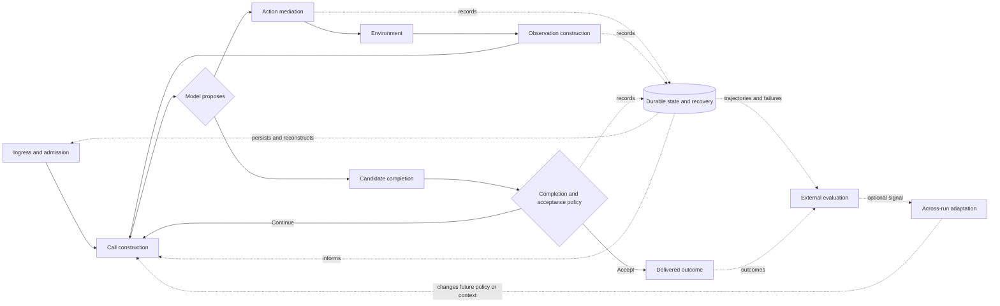

# Where Harnesses Put Control

## Model-directed loops inside programmed execution and recovery envelopes

Imagine an agent has been asked to change a small piece of code, run the relevant tests, and report completion.

It edits the file, reads some output, and says: “Done.”

Who decided the task was done?

The obvious answer is “the model.” That answer is often partly true and architecturally incomplete. The model may have chosen the edit and emitted the final text, but software around it decided:

- which request entered which session;
- which model, instructions, history, and tools were visible;
- whether the edit was authorized and where it executed;
- which part of the test output returned to the model;
- what survived a crash or context limit;
- whether “Done” was accepted, challenged, or independently checked;
- and whether anything learned from the run changed future behavior.

Harness engineering lives in those decisions.

This chapter develops a practical way to trace them. It uses four pinned, reviewed implementations—Pi, OpenHands Software Agent SDK, OpenClaw, and Hermes Agent—as concrete evidence. All four contain a model-directed choice loop inside programmed execution, state, integrity, and recovery boundaries. They differ substantially in where those boundaries begin and what counts as an acceptable completion. This is an observed four-case pattern, not proof of a universal or optimal architecture. ([Synthesis C001](../../research/claims/first-batch-harness-architecture.md#c001))

## What you should be able to do afterward

By the end, you should be able to take a harness diagram or codebase and ask:

1. Which decisions are genuinely delegated to the model?
2. Which program, operator, provider, or extension controls each boundary?
3. What state is durable, and what information is actually visible to the next call?
4. What happened in the environment, and what evidence of it reached the model?
5. Does the harness merely keep the run valid, or does it verify the task outcome?
6. Does an across-run change respond to measured outcomes, or only to usage, recency, and model-authored interpretation?

## The core mental model: seven control contracts plus evaluation

The most useful starting point is not “agent versus workflow.” It is seven active-system control contracts plus a separate external-evaluation contract.

| Contract | The question it answers |
| --- | --- |
| **Admission** | What starts work, under which identity, session, and lifecycle? |
| **Call construction** | What model, instructions, history, state, and capabilities enter this call? |
| **Action authority** | Which model-proposed effects may actually execute? |
| **Observation** | Which consequences become evidence for the next model decision? |
| **Continuity** | What persists, retries, recovers, compacts, or disappears? |
| **Acceptance** | What counts as finished, verified, or acceptable? |
| **Adaptation** | What changes future runs, based on which signal? |
| **External evaluation** | How are trajectories and outcomes assessed across tasks, trials, versions, and costs? |

This is a learning scaffold, not a replacement for the project's R1–R11 analytical lens and not a claim that every implementation is a linear pipeline. One function can own several contracts; one contract can be distributed across many components; a contract can be absent. External evaluation ordinarily sits outside the active run.



The diagram is an analytical trace. Real systems nest and repeat these stages. Durable state and recovery are shown as a sidecar because they can participate before and after several effects. External evaluation can consume accepted outcomes, rejected or failed trajectories, or both; it may be absent and need not feed adaptation.

> **Common confusion — model-directed is not model-controlled.**
>
> A model can choose the next tool while ordinary code controls whether the tool exists, whether the call is legal, where it executes, how its result is shaped, whether the run retries, and whether completion is accepted.

## Walkthrough: one small coding task

We will follow one imagined task through the contracts:

> Change a validation function, run the relevant tests, and report completion.

The example is deliberately ordinary. The point is not the task; it is the hidden decisions surrounding it.

### 1. Admission: which run did the request enter?

In a compact CLI agent, admission may look like a user line entering the active session. In a long-lived runtime, the same visible request can cross channel authorization, durable ingress, deduplication, routing, queueing, and session selection before a model is called.

Pi distinguishes product/session lifecycle from its inner model/tool loop. OpenHands distinguishes service, conversation, run, step, and tool-call lifecycles. OpenClaw's reviewed Telegram path crosses a durable ingress queue, channel lanes, session routing, reply operations, and embedded attempts. Hermes distinguishes process, session, turn, iteration, tool, child, goal, and background-review boundaries.

Why this matters: a crash “during the run” is underspecified. Did the request reach durable ingress? Was it assigned to a session? Was the model call in flight? Was a tool effect committed? Was delivery pending? Each lifecycle can have a different owner and recovery rule.

For our task, ask:

- Was the request durably admitted before model work began?
- Could another request share or race with this session?
- If the process dies now, does the request replay, disappear, or duplicate?

<details>
<summary>Evidence trail: lifecycle and admission</summary>

- Synthesis finding: [C002](../../research/claims/first-batch-harness-architecture.md#c002)
- Case evidence: [Pi](../../research/claims/pi-v0.80.6.md#c001), [OpenHands](../../research/claims/openhands-sdk-v1.35.0.md#c003), [OpenClaw](../../research/claims/openclaw-v2026.6.6.md#c001), [Hermes](../../research/claims/hermes-agent-v0.18.2.md#c002)
- Status: inference over verified implementation facts

</details>

### 2. Call construction: what problem did the model actually see?

The user request is only one input. A real call may include:

- a selected model and provider;
- a system prompt;
- project and user instructions;
- prior messages or a compressed projection;
- tool schemas;
- skills or rules;
- retrieved memory;
- provider-specific normalization;
- ephemeral plugin context;
- current files, environment metadata, or working directory.

Pi rebuilds its coding prompt and active tools from project instructions, skills metadata, tool policy, and extension state. OpenHands keeps frozen agent policy separate from the active conversation `View`, then materializes plugins, skills, tools, and call context. OpenClaw resolves provider/model, bootstrap material, skills, context-engine state, system instructions, and the effective tool set for an embedded run. Hermes combines a cached system prompt with request-local history, plugin context, memory, tool schemas, provider normalization, and route-specific request fields.

Much of this input is materialized by runtime code, configuration, providers, and extensions rather than selected by the model. Those layers shape the evidence and capabilities from which the model chooses.

For our task, ask:

- Did the model receive the repository's current instructions?
- Were test tools visible and executable, or merely mentioned?
- Did compaction omit an earlier requirement?
- Did a provider fallback change model behavior or supported tool semantics?
- Did a plugin add instructions after the configuration snapshot?

<details>
<summary>Evidence trail: distributed control</summary>

- Synthesis findings: [C002](../../research/claims/first-batch-harness-architecture.md#c002) and [C007](../../research/claims/first-batch-harness-architecture.md#c007)
- Pi: [prompt/capability construction](../../research/claims/pi-v0.80.6.md#c003)
- OpenHands: [policy and runtime materialization](../../research/claims/openhands-sdk-v1.35.0.md#c004)
- OpenClaw: [embedded-run materialization](../../research/claims/openclaw-v2026.6.6.md#c006)
- Hermes: [prompt construction](../../research/claims/hermes-agent-v0.18.2.md#c003) and [provider routing](../../research/claims/hermes-agent-v0.18.2.md#c024)
- Status: inference over verified implementation facts
- Limit: configuration and installed extensions can change a concrete deployment

</details>

### 3. Model proposal: local choice inside global constraints

Now the model proposes an action, perhaps:

```text
edit(file="validator.ts", old="...", new="...")
```

That proposal is important. It is not yet an environment effect.

In each reviewed case, the model directs the local action sequence. Programmed code owns surrounding semantics such as budgets, message pairing, turn order, retries, cancellation, and termination. Pi's loop ends when the model produces no tool calls and no queued work remains. OpenHands interprets assistant content or a finish action as completion on the ordinary path. OpenClaw surrounds embedded model work with queue, replay, liveness, timeout, and delivery policy. Hermes adds provider restoration, compression, malformed-call recovery, verification nudges, and finalization.

The architecture is hybrid even when the UI feels autonomous.

<details>
<summary>Evidence trail: model proposal inside programmed control</summary>

- Synthesis finding: [C001](../../research/claims/first-batch-harness-architecture.md#c001)
- Status: four-case inference; no universality or effectiveness claim

</details>

### 4. Action authority: may the edit happen?

Between proposal and effect, a harness can apply:

- schema validation;
- tool-name and argument normalization;
- allow/deny policy;
- approval prompts;
- security or risk analysis;
- concurrency and resource locks;
- hooks or middleware;
- sandbox or remote-backend selection;
- checkpoints or reversible transaction policy.

Pi validates tool arguments and exposes trusted pre/post hooks; a pinned test shows a pre-call hook can mutate an already validated argument object. OpenHands normalizes calls into typed actions and can apply risk analysis, confirmation, synchronous blocking hooks, and runtime executors—but its direct `execute_tool()` helper intentionally bypasses those loop safeguards. OpenClaw assembles several tool-policy layers and optional sandboxing, with sandbox mode off by default. Hermes filters schemas, runs middleware, approval and guardrail policy, and then dispatches through the selected environment backend; fresh local-terminal configuration executes directly on the host.

For our task, ask:

- Was the exact mutation validated immediately before execution?
- Can trusted extension code change it afterward?
- Does “approval” mean human approval, model approval, policy approval, or none?
- Is the tool running on the host, in a container, or through a remote service?
- If two tools run concurrently, what state or files can they race over?

> **Common confusion — a tool schema is not the whole authority boundary.**
>
> Schema validation answers whether a request has an expected shape. It does not by itself answer who may execute it, where it runs, whether later hooks can mutate it, or whether the environment is isolated.

<details>
<summary>Evidence trail: action authority</summary>

- Synthesis findings: [C004](../../research/claims/first-batch-harness-architecture.md#c004) and [C008](../../research/claims/first-batch-harness-architecture.md#c008)
- Case evidence: [Pi](../../research/claims/pi-v0.80.6.md#c004), [OpenHands](../../research/claims/openhands-sdk-v1.35.0.md#c006), [OpenClaw](../../research/claims/openclaw-v2026.6.6.md#c008), [Hermes](../../research/claims/hermes-agent-v0.18.2.md#c006)
- Status: inference over pinned implementation facts

</details>

### 5. Observation: what did the model learn from the effect?

Suppose the edit succeeds and the test command returns 40,000 characters. The environment result and the model observation are not necessarily the same object.

Pi bounds file and shell outputs and may store a full copy elsewhere. OpenHands converts executor results into typed observations, adding fields and truncating or spilling output before creating the model message. OpenClaw keeps canonical transcript results distinct from provider-facing bounded projections and has an explicit last-resort recovery rewrite. Hermes can transform results, spill large content, add retrieval hints, normalize multimodal data, and then append the model-facing tool observation.

This boundary determines the model's evidence. A test may have failed in a truncated section. A file read may show only a head window. A canonical transcript may preserve content the next provider call never receives. A formatter may convert an exception into actionable guidance—or hide detail.

For our task, ask:

- What raw evidence existed?
- What transformation occurred?
- What was omitted or summarized?
- Can the model retrieve the omitted detail?
- Does the durable record match the model-facing projection?

SWE-agent's historical experiments give good reason to treat the agent-computer interface as outcome-relevant. They do not prove that any exact interface here is superior, and the current cases do not test browser or GUI perception. ([Synthesis C004](../../research/claims/first-batch-harness-architecture.md#c004), [C011](../../research/claims/first-batch-harness-architecture.md#c011))

> **Common confusion — the tool result is not necessarily the observation.**
>
> “The command returned X” and “the model saw X” are different claims. Trace the transformation.

### 6. Continuity: what survives the next call—or a crash?

The four cases all distinguish durable state from active context.

Pi stores an append-only session tree while showing the model the active branch plus a compaction-aware projection. OpenHands stores an event tree while its active `View` admits model-convertible events and can apply condensation when the selected agent configuration enables it. OpenClaw distributes continuity across registries, transcripts, ingress queues, workspace files, memory, and process-local attempt state. Hermes uses SQLite and memory files alongside a cached system prompt, request-local additions, and a compacted active projection.

This produces a crucial rule:

> **Persisted does not mean visible.**

A requirement can remain in raw history and still be absent from the next model call. A summary can preserve enough information for one task and erase a dependency needed later. Keeping the raw transcript helps audit or recovery but does not make the active context semantically faithful.

Summarization compaction is **contested** in this evidence set. It solves a real context-bound problem and appears in several forms across the cases. Recent preprints report loss, latency, and variability under other protocols. None directly evaluates the four pinned implementations, so neither “safe default” nor “anti-pattern” is justified. ([Synthesis C003](../../research/claims/first-batch-harness-architecture.md#c003), [C012](../../research/claims/first-batch-harness-architecture.md#c012))

For our task, ask:

- Is the original requirement still in active context after compaction?
- Is the test result durable before the next action?
- If the process dies after editing but before persisting the tool result, what reconstructs the state?
- Can a resumed session rebuild the same prompt if plugins or external resources changed?

### 7. Candidate completion: “Done” is an event, not a proof

The model now emits a final answer. At this moment, separate four layers:

1. **Protocol integrity:** Are calls/results paired, schemas valid, and state transitions legal?
2. **Operational recovery:** Can the system retry, resume, repair, or deliver after failure?
3. **Completion and task acceptance:** What lets a candidate stop, and does that policy require adequate evidence that the requested change is correct?
4. **External evaluation:** Across many tasks and trials, how well does the system perform?

These layers are easy to praise as one thing called “verification.” The cases show why that is misleading.

#### Pi

Pi has retries, overflow recovery, cancellation, and model-visible tool errors. The default inspected path has no independent acceptance gate. The model can run tests through the shell, but ordinary completion does not require it.

#### OpenHands

OpenHands has strong event integrity, recovery, leases, and stuck detection. A critic and `/goal` judge can add task checks, but the critic defaults absent and fails open on evaluator exceptions; `/goal` is a separate optional loop.

#### OpenClaw

OpenClaw invests in transport, replay, liveness, session, and delivery integrity. Optional finalization hooks and QA systems exist, but they are not default proof that every ordinary completion is correct.

#### Hermes

Hermes may apply verification-on-stop for code-like changes and can run an optional persistent goal judge. The verification policy asks the same agent for fresh evidence; it does not independently execute arbitrary tests. Its effective activation can differ between fresh, versionless, migrated, and explicit configurations. The goal judge is optional and its accuracy is unmeasured here.

The safe conclusion is not “harnesses lack verification.” Every ordinary path has a completion policy, but some policies simply accept a model-authored stop. The more useful conclusion is:

> Runtime integrity, model-authored completion, evidence-backed task acceptance, and external evaluation are different contracts whose activation, evidence source, and failure posture must be named.

([Synthesis C005](../../research/claims/first-batch-harness-architecture.md#c005))

Research strengthens the distinction but not the exact implementations. Kamoi and collaborators found reliable external feedback more credible than ungrounded intrinsic self-correction in the literature they reviewed. Anthropic's evaluation guidance separates agent execution from the evaluation harness and distinguishes trajectories from outcomes. Neither source directly validates Pi's stopping rule, OpenHands's critic, OpenClaw's finalizer, or Hermes's judge. ([Synthesis C006](../../research/claims/first-batch-harness-architecture.md#c006))

> **Common confusion — tests are not one thing.**
>
> Unit tests of harness code can check a regression invariant under their tested conditions. A model running task tests can provide in-run evidence. A benchmark can estimate system outcomes. These are different contracts and do not substitute automatically.

### 8. External evaluation: a trace is not a score

All four systems record useful operational evidence: events, transcripts, costs, usage, traces, tests, and diagnostics. Those records help answer “what happened?” They do not by themselves answer “did the harness solve the task?” or “did this mechanism cause improvement?” ([Synthesis C009](../../research/claims/first-batch-harness-architecture.md#c009))

One admitted operational result comes from OpenHands: its authors report a 61% reduction in system-attributable errors for V1 versus V0 during a 15-day parallel rollout, plus low event persistence and replay overhead. This is valuable evidence for the redesign bundle. It is not an ablation of event sourcing, typed actions, co-location, recovery, or another individual mechanism. ([Synthesis C013](../../research/claims/first-batch-harness-architecture.md#c013))

For our task, a trace might show that the agent edited a file and ran a command. An outcome grader might inspect the repository state and run hidden tests. A trajectory grader might judge whether the agent used unsafe or wasteful steps. A robust evaluation might repeat the task because model behavior is non-deterministic. Each answers a different question.

### 9. Adaptation: what changes the next run?

Suppose the agent stores a note: “This repository uses command X for validation.” Future runs retrieve it. Has the harness improved?

It has adapted. Improvement is a stronger claim.

OpenClaw's optional memory dreaming promotes material using recall, diversity, recency, and contamination signals. Hermes can run background review that changes memory or skills from conversation content and corrections; its curator also uses usage and recency. Neither inspected mechanism measures task outcomes and selects future changes because those outcomes improved. ([Synthesis C010](../../research/claims/first-batch-harness-architecture.md#c010))

To call a mechanism outcome-driven optimization, look for:

1. a defined outcome measure;
2. a baseline or competing candidates;
3. a rule connecting measured outcomes to selection;
4. retention or rollback policy;
5. evidence that later performance changed under comparable conditions.

Without that loop, use precise terms such as memory update, curation, skill mutation, or across-run adaptation. Avoid “self-improvement” as a shortcut.

MemoryAgentBench reports a useful warning from a different evaluation setting: no method it tested mastered all of accurate retrieval, test-time learning, long-range understanding, and conflict resolution or selective forgetting. It does not evaluate OpenClaw or Hermes, but it reinforces why a system that writes or promotes memories should not be assumed to have competent memory behavior. ([Synthesis C010](../../research/claims/first-batch-harness-architecture.md#c010))

## The default trap

An easy and recurring mistake when reading a feature-rich repository is to describe possible behavior as ordinary behavior.

| Statement | What must be established |
| --- | --- |
| “The harness has a critic.” | A critic implementation exists. |
| “The harness uses a critic.” | The relevant entry point activates it. |
| “The critic gates completion.” | The critic's result actually controls acceptance. |
| “The critic improves outcomes.” | A credible comparison measures that effect. |

This distinction appears everywhere:

- Pi's subagents are an optional extension.
- OpenHands's direct `Agent` has no condenser, while a preset installs one.
- OpenClaw's sandbox and dreaming are disabled by default.
- Hermes's verification policy can differ by configuration generation, and `/goal` is optional.

A useful default statement names the version, surface or entry point, activation state, configuration origin, migration population where relevant, and effective runtime value. ([Synthesis C007](../../research/claims/first-batch-harness-architecture.md#c007))

> **Common confusion — available does not mean active.**
>
> Capability inventories tell you what a platform can express. They do not tell you what an ordinary run does.

## Extensions: where control can move after the diagram was drawn

Extensions, hooks, plugins, middleware, skills, and provider adapters are often presented as one “extensibility” feature. Architecturally, they are injection surfaces.

The useful questions are:

- At what lifecycle point does the injection run?
- Who can install or activate it?
- Can it block, transform, replace, or only observe?
- Does it run before or after an irreversible effect?
- What state can it read or mutate?
- What happens if it fails?
- Does its behavior persist across resume?
- Can the exact extension version be reconstructed?

In Pi, trusted hooks can mutate validated tool arguments. OpenHands ambient plugins can be rediscovered on resume. OpenClaw hooks span model selection through delivery. Hermes plugins and middleware span calls, context, tools, verification, sessions, children, and gateway events.

This is why extension/policy injection is a cross-cutting dimension rather than one isolated module. ([Synthesis C008](../../research/claims/first-batch-harness-architecture.md#c008))

## Delegation: more agents are not automatically more evidence

Each reviewed repository can express delegation, usually as an optional capability. Separate child contexts may help divide work. They do not automatically create independent reasoning or verified results.

Ask:

- Who decomposes the task?
- Do children share model, prompt lineage, workspace, or errors?
- Are outputs text summaries, artifacts, tests, or independently checked claims?
- How is conflicting work resolved?
- Is total model budget matched to a single-agent baseline?

BenchAgent's controlled internal comparison reports that five of six tested multi-agent workflows trailed a matched single-agent anchor. A separately evaluated Claude-Code-style runtime performed strongly under a different protocol. That is not evidence that subagents are bad. It is evidence that role count alone is a poor explanation: decomposition, state isolation, artifacts, verification, aggregation, and budget matter. ([Synthesis C014](../../research/claims/first-batch-harness-architecture.md#c014))

## Recurrence, influence, and convergence

If two implementations share a mechanism, there are several possible explanations:

- independent discovery under similar constraints;
- direct port;
- compatibility translation;
- documented inspiration;
- shared dependency or provider constraint;
- imitation without a recorded link;
- or coincidence.

OpenClaw and Hermes illustrate why this matters. Their recorded Git roots differ, but Hermes later added explicit OpenClaw migration, an OpenClaw-inspired permission change, an orchestrator prompt modeled on an OpenClaw helper, and a named port of a streaming fix. That supports selective influence and translation. It supports neither “Hermes is simply an OpenClaw fork” nor “the pair independently converged.” ([Synthesis C015](../../research/claims/first-batch-harness-architecture.md#c015))

Count recurrence as evidence of use in the observed implementations. Count independent corroboration only after checking lineage for the specific mechanism.

## A builder's control review

When you design or audit a harness, walk through these questions.

### Admission

- What durable fact says the task exists?
- How are identity, routing, and session chosen?
- Which lifecycle owns cancellation and completion?

### Call construction

- Which model and provider are effective for this call?
- Which instruction sources can conflict?
- What state is visible, summarized, retrieved, or absent?
- Are visible tools synchronized with executable tools?

### Action authority

- Where is the last validation before effect?
- Which hooks or policies can change the request afterward?
- Where does execution occur, and under whose authority?
- What concurrency assumptions protect shared state?

### Observation

- What raw result existed?
- What was truncated, normalized, summarized, or spilled?
- Can the model recover omitted evidence?
- Is the canonical record different from the active projection?

### Continuity

- What survives a call, turn, crash, session, and upgrade?
- Which writes happen before side effects and which after?
- Can resume reproduce the same effective configuration?
- What does compaction preserve for the model, not merely for storage?

### Acceptance

- What evidence is required before accepting completion?
- Is feedback executable, environmental, model-authored, or human?
- Is the judge independent of the actor?
- Do failures continue, fail open, fail closed, pause, or escalate?

### Adaptation

- What artifact changes future behavior?
- Which signal triggers and selects that change?
- How are errors, staleness, and conflicts removed?
- Is benefit measured, or merely assumed from mutation?

## What the evidence does and does not support

### Supported within the four reviewed pins

- Model-directed choice occurs inside substantial programmed control.
- Durable state and active model context are distinct.
- Action execution and model-visible observation are distinct questions.
- Runtime integrity, task acceptance, and external evaluation are different contracts.
- Default and optional capability must be reported separately.
- Injection surfaces distribute control across architectural responsibilities.
- Across-run mutation is not automatically outcome-driven optimization.

### Not established

- That this architecture is universally best.
- That the pattern independently converged across all four systems.
- That typed tools, compaction, event sourcing, delegation, or adaptation improve outcomes in these exact implementations.
- That one system is categorically safer or more correct.
- That the findings transfer unchanged to browser or GUI perception.
- That the corpus is representative or saturated.

The original landscape also carries reconstructed provenance. The implementation findings here rely on later complete, pinned case packages; the broader field-coverage caveat remains. ([Synthesis C017](../../research/claims/first-batch-harness-architecture.md#c017))

## Glossary

**Active context**
The material actually included in a model call: instructions, selected history, observations, retrieved state, and visible capabilities.

**Task acceptance**
The policy that decides whether a candidate outcome is good enough to stop or deliver. It may weakly accept a model-authored completion or require stronger executable, environmental, judged, or human evidence.

**Runtime integrity**
Properties that keep execution structurally valid: paired calls/results, legal state transitions, valid schemas, ordering, and bounded effects.

**Operational recovery**
Mechanisms that restore or continue work after failure: retry, replay, resume, repair, fallback, compaction recovery, and escalation.

**External evaluation**
Assessment outside the ordinary task loop, often across tasks, trials, outcomes, trajectories, costs, or versions.

**Observation construction**
The transformation from an environment result into the evidence presented to the model.

**Effective configuration population**
The set of runs to which a claimed default actually applies—for example fresh installs, migrated configs, direct constructors, presets, or a specific channel.

**Injection surface**
A lifecycle point where plugins, hooks, middleware, providers, operators, or policies can observe or change behavior.

**Across-run adaptation**
An intentional future-behavior change driven by experience, usage, correction, evaluation, or another signal.

**Outcome-driven optimization**
A stronger loop in which measured outcomes select future changes under an explicit objective.

**Independent corroboration**
Evidence whose relevant mechanism or conclusion does not derive from the same source, lineage, protocol, or influence path.

## Recap

The model is one controller inside a larger system. Surrounding runtime code, configuration, operators, providers, and extensions collectively decide what the model sees, what it may do, what consequences return, what survives, what counts as success, and whether future behavior changes.

The single most important habit is to replace vague capability words with contracts:

- not “memory,” but stored where, retrieved when, and visible to whom;
- not “tools,” but proposed, authorized, executed, and observed how;
- not “verification,” but runtime integrity, evidence acquisition, acceptance, or external evaluation;
- not “self-improvement,” but which artifact changed, from which signal, selected by what outcome.

That shift turns a feature list into an architecture.

## Reflection questions

1. Which decisions should your model make, and which should remain deterministic?
2. What evidence must exist before your harness accepts completion?
3. Where can information be durable yet invisible to the model?
4. Which extension surfaces can change authority after validation?
5. What happens if the process crashes between action, persistence, and delivery?
6. Which optional capability in your system is easiest to mistake for default behavior?
7. Does an across-run change respond to task outcomes, or merely to usage, recency, and model-authored interpretation?
8. What experiment would distinguish a plausible architectural benefit from implementation sophistication?

## Suggested next reading

- [Canonical first-batch synthesis](../../research/syntheses/first-batch-harness-architecture.md)
- [Pi v0.80.6 case](../../research/case-studies/pi-v0.80.6.md)
- [OpenHands SDK v1.35.0 case](../../research/case-studies/openhands-sdk-v1.35.0.md)
- [OpenClaw v2026.6.6 case](../../research/case-studies/openclaw-v2026.6.6.md)
- [Hermes Agent v0.18.2 case](../../research/case-studies/hermes-agent-v0.18.2.md)
- [Checkpoint 3 taxonomy and method review](../../research/cycles/checkpoint-3-taxonomy-and-method-review.md)
- [Reader feedback](../READER-FEEDBACK.md)

## What changed

**2026-07-18:** First provisional chapter derived from the four reviewed cases and approved D-013 synthesis direction. No browser/perception or closed-production case is yet included.
